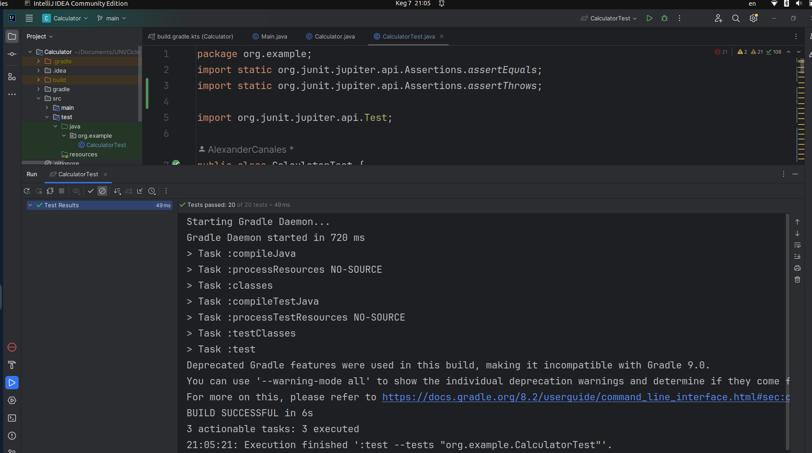

# Actividad AAA
## Implementación de las pruebas
Se creó 20 pruebas unitarias, estos abarcan todos los casos límites  
``` java
package org.example;
import static org.junit.jupiter.api.Assertions.assertEquals;
import static org.junit.jupiter.api.Assertions.assertThrows;

import org.junit.jupiter.api.Test;

public class CalculatorTest {
    // TESTS SUMAR
    @Test
    public void testSum_PositiveNumbers_ShouldReturnCorrectSum() {
        // Arrange
        Calculator calculador = new Calculator();
        int numeroA = 10;
        int numeroB = 5;

        // Act
        int resultado = calculador.sumar(numeroA, numeroB);

        // Assert
        assertEquals(15, resultado, "10 + 5 deberia ser 15");
    }
    @Test
    public void testSum_NegativeNumbers_ShouldReturnCorrectSum() {
        // Arrange
        Calculator calculador = new Calculator();
        int numeroA = -10;
        int numeroB = -5;

        // Act
        int resultado = calculador.sumar(numeroA, numeroB);

        // Assert
        assertEquals(-15, resultado, "-10 + -5 deberia ser -15");
    }
    @Test
    public void testSum_PositiveAndNegativeNumbers_ShouldReturnCorrectSum() {
        // Arrange
        Calculator calculador = new Calculator();
        int numeroA = 10;
        int numeroB = -5;

        // Act
        int resultado = calculador.sumar(numeroA, numeroB);

        // Assert
        assertEquals(5, resultado, "10 + -5 deberia ser 5");
    }
    @Test
    public void testSum_NegativeAndNegativeNumbers_ShouldReturnCorrectSum() {
        // Arrange
        Calculator calculador = new Calculator();
        int numeroA = -10;
        int numeroB = 5;

        // Act
        int resultado = calculador.sumar(numeroA, numeroB);

        // Assert
        assertEquals(-5, resultado, "-10 + 5 deberia ser -5");
    }

    // TESTS RESTAR
    @Test
    public void testRes_PositiveNumbers_ShouldReturnCorrectRes(){
        // Arrange
        Calculator calculador = new Calculator();
        int numeroA = 10;
        int numeroB = 5;

        // Act
        int resultado = calculador.restar(numeroA, numeroB);

        // Assert
        assertEquals(5, resultado, "10 - 5 deberia ser 5");
    }
    @Test
    public void testRes_NegativeNumbers_ShouldReturnCorrectRes(){
        // Arrange
        Calculator calculador = new Calculator();
        int numeroA = -10;
        int numeroB = -5;

        // Act
        int resultado = calculador.restar(numeroA, numeroB);

        // Assert
        assertEquals(-5, resultado, "-10 - -5 deberia ser -5");
    }
    @Test
    public void testRes_PositiveAndNegativeNumbers_ShouldReturnCorrectRes(){
        // Arrange
        Calculator calculador = new Calculator();
        int numeroA = 10;
        int numeroB = -5;

        // Act
        int resultado = calculador.restar(numeroA, numeroB);

        // Assert
        assertEquals(15, resultado, "10 - -5 deberia ser 15");
    }
    @Test
    public void testRes_NegativeAndPositiveNumbers_ShouldReturnCorrectRes(){
        // Arrange
        Calculator calculador = new Calculator();
        int numeroA = -10;
        int numeroB = 5;

        // Act
        int resultado = calculador.restar(numeroA, numeroB);

        // Assert
        assertEquals(-15, resultado, "-10 - 5 deberia ser -15");
    }

    // TEST MULTIPLICAR
    @Test
    public void testMult_PositiveNumbers_ShouldReturnCorrectMult(){
        // Arrange
        Calculator calculador = new Calculator();
        int numeroA = 10;
        int numeroB = 5;

        // Act
        int resultado = calculador.multiplicacion(numeroA, numeroB);

        // Assert
        assertEquals(50, resultado, "10 * 5 deberia ser 50");
    }
    @Test
    public void testMult_NegativeNumbers_ShouldReturnCorrectMult(){
        // Arrange
        Calculator calculador = new Calculator();
        int numeroA = -10;
        int numeroB = -5;

        // Act
        int resultado = calculador.multiplicacion(numeroA, numeroB);

        // Assert
        assertEquals(50, resultado, "-10 * -5 deberia ser 50");
    }
    @Test
    public void testMult_PositiveAndNegativeNumbers_ShouldReturnCorrectMult(){
        // Arrange
        Calculator calculador = new Calculator();
        int numeroA = 10;
        int numeroB = -5;

        // Act
        int resultado = calculador.multiplicacion(numeroA, numeroB);

        // Assert
        assertEquals(-50, resultado, "10 * -5 deberia ser -50");
    }
    @Test
    public void testMult_NegativeAndPositiveNumbers_ShouldReturnCorrectMult(){
        // Arrange
        Calculator calculador = new Calculator();
        int numeroA = -10;
        int numeroB = 5;

        // Act
        int resultado = calculador.multiplicacion(numeroA, numeroB);

        // Assert
        assertEquals(-50, resultado, "-10 * 5 deberia ser -50");
    }

    // TESTS DIVIDIR
    @Test
    public void testDiv_PositiveNumbers_ShouldReturnCorrectDiv(){
        // Arrange
        Calculator calculador = new Calculator();
        int numeroA = 10;
        int numeroB = 5;

        // Act
        double resultado = calculador.division(numeroA, numeroB);

        // Assert
        assertEquals(2, resultado, "10 / 5 deberia ser 2");
    }
    @Test
    public void testDiv_NegativeNumbers_ShouldReturnCorrectDiv(){
        // Arrange
        Calculator calculador = new Calculator();
        int numeroA = -10;
        int numeroB = -5;

        // Act
        double resultado = calculador.division(numeroA, numeroB);

        // Assert
        assertEquals(2, resultado, "-10 / -5 deberia ser 2");
    }
    @Test
    public void testDiv_PositiveAndNegativeNumbers_ShouldReturnCorrectDiv(){
        // Arrange
        Calculator calculador = new Calculator();
        int numeroA = 10;
        int numeroB = -5;

        // Act
        double resultado = calculador.division(numeroA, numeroB);

        // Assert
        assertEquals(-2, resultado, "10 / -5 deberia ser -2");
    }
    @Test
    public void testDiv_NegativeAndPositiveNumbers_ShouldReturnCorrectDiv(){
        // Arrange
        Calculator calculador = new Calculator();
        int numeroA = -10;
        int numeroB = 5;

        // Act
        double resultado = calculador.division(numeroA, numeroB);

        // Assert
        assertEquals(-2, resultado, "-10 / 5 deberia ser -2");
    }
    @Test
    public void testDiv_ZeroAndPositiveNumbers_ShouldReturnCorrectDiv(){
        // Arrange
        Calculator calculador = new Calculator();
        int numeroA = 0;
        int numeroB = 5;

        // Act
        double resultado = calculador.division(numeroA, numeroB);

        // Assert
        assertEquals(0, resultado, "0 / 5 deberia ser 0");
    }
    @Test
    public void testDiv_ZeroAndNegativeNumbers_ShouldReturnCorrectDiv(){
        // Arrange
        Calculator calculador = new Calculator();
        int numeroA = 0;
        int numeroB = -5;

        // Act
        double resultado = calculador.division(numeroA, numeroB);

        // Assert
        assertEquals(0, resultado, 0.0001,"0 / -5 deberia ser 0");
    }
    @Test
    public void testDiv_PositiveAndZeroNumbers_ShouldReturnCorrectDiv(){
        // Arrange
        Calculator calculador = new Calculator();
        int numeroA = 10;
        int numeroB = 0;

        // Act y Assert
        assertThrows(ArithmeticException.class, () ->{
            calculador.division(numeroA, numeroB);
        });
    }
    @Test
    public void testDiv_NegativeAndZeroNumbers_ShouldReturnCorrectDiv(){
        // Arrange
        Calculator calculador = new Calculator();
        int numeroA = -10;
        int numeroB = 0;

        // Act y Assert
        assertThrows(ArithmeticException.class, () ->{
            calculador.division(numeroA, numeroB);
        });
    }
}
```

## Ejecución de las pruebas
Luego de crear las pruebas para cada método, escribo el comando ```./gradlew test``` para ejecutarlas   
  

Al ejecutar las pruebas apretando el botón de run se obtiene lo siguiete:  
  

Aquí se puede ver que pasaron las 20 pruebas unitarias. 
