# Actividad PlayDocker
Para iniciar sesión en Play With Docker (PWD) debes tener una cuenta de Docker Hub (en caso de no tener, crear una cuenta [sign up Docker Hub](https://hub.docker.com/signup)), las credenciales de tu cuenta de Docker Hub son las mismas para PWD ([PWD sign in](https://labs.play-with-docker.com/)). Luego de iniciar sesión debe aparecer las siguiente pantallas:  

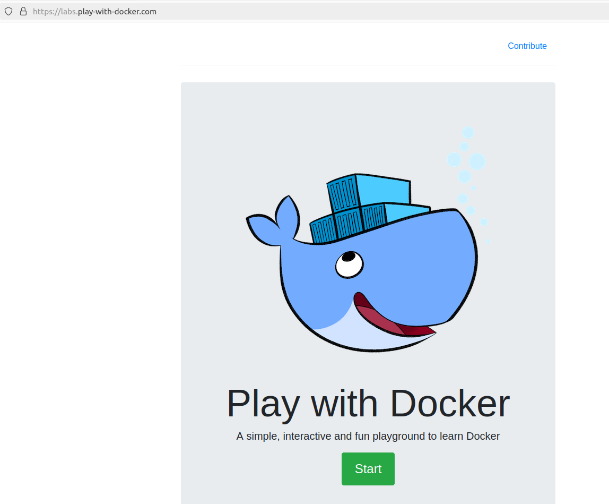  
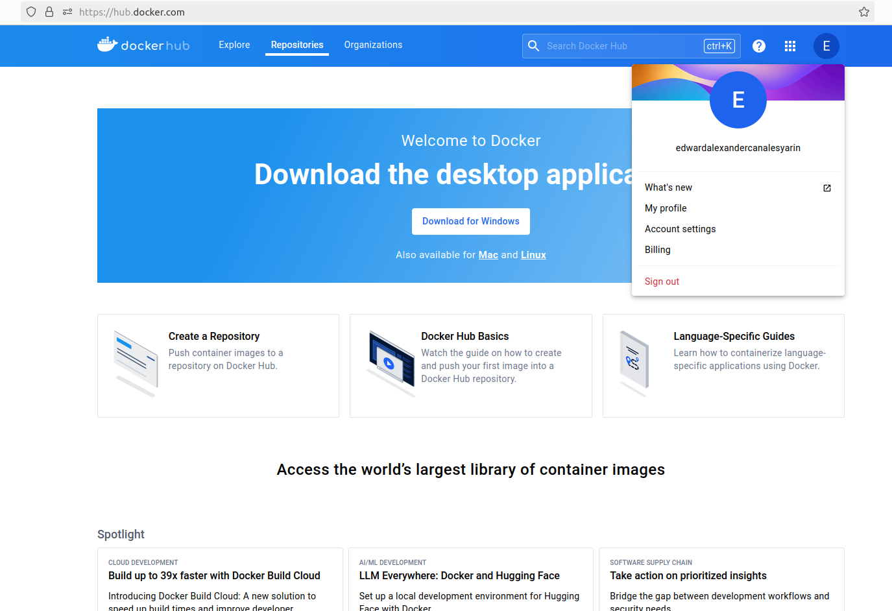  

Ahora vamos a dirigirnos a PWD classroom ([PWD classroom](https://training.play-with-docker.com/)) donde encontraremos los tutoriales. En esta oportunidad desarrollaré el Stage 1 y 2 del tutorial llamado _Getting Started Walk-through for Developers_:  
## Getting Started Walk-through for Developers
### Stage 1
Esta etapa será  
* Familiarizarse con los conceptos centrales de Docker  
* Mostrarle cómo crear e implementar aplicaciones básicas.
Tutoriales autoguiados en el navegador
- [Docker for Beginners - Linux](https://training.play-with-docker.com/beginner-linux/)  
- [Application Containerization and Microservice Orchestration](https://training.play-with-docker.com/microservice-orchestration/)  
- [Deploying a Multi-Service App in Docker Swarm Mode](https://training.play-with-docker.com/swarm-stack-intro/)  

**DESARROLLO**  
#### Docker for Beginners - Linux
En esta práctica de laboratorio, veremos algunos comandos básicos de Docker y un flujo de trabajo simple de construcción, envío y ejecución. Comenzaremos ejecutando algunos contenedores simples y luego usaremos un Dockerfile para crear una aplicación personalizada. Finalmente, veremos cómo usar montajes de enlace para modificar un contenedor en ejecución como lo haría si estuviera desarrollando activamente usando Docker. Dificultad: principiante (se supone que no está familiarizado con Docker) Tiempo: Aproximadamente 30 minutos  

Tareas:  

- Tarea 0: Requisitos previos  
- Tarea 1: ejecutar algunos contenedores Docker simples  
- Tarea 2: empaquetar y ejecutar una aplicación personalizada usando Docker  
- Tarea 3: modificar un sitio web en ejecución  

**Tarea 0: Requisitos previos**  
- Clonar el repositorio de GitHub del laboratorio
```git clone https://github.com/dockersamples/linux_tweet_app```

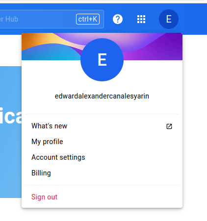  
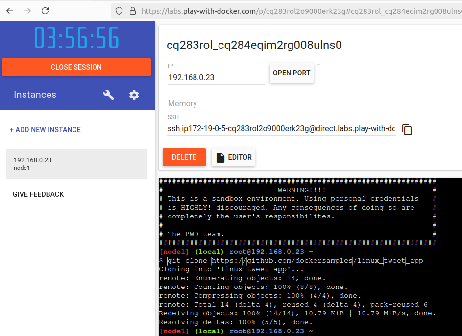  

- Asegúrate de tener una DockerID  
Si no tiene un DockerID (un inicio de sesión gratuito utilizado para acceder a Docker Hub), visite Docker Hub y regístrese para obtener uno. Lo necesitará para pasos posteriores. 
Tu nombre de usuario es tu DockerID

**Tarea 1: ejecutar algunos contenedores Docker simples**
Hay diferentes formas de utilizar contenedores. Éstas incluyen:  
* Para ejecutar una sola tarea: podría ser un script de shell o una aplicación personalizada.                   * Interactivamente: esto lo conecta al contenedor de manera similar a la forma en que ingresa mediante SSH a un servidor remoto.  
* En segundo plano: para servicios de larga duración, como sitios web y bases de datos.  

En esta sección probará cada una de esas opciones y verá cómo Docker administra la carga de trabajo  

* **Ejecute una sola tarea en un contenedor Alpine Linux**
En este paso, iniciaremos un nuevo contenedor y le indicaremos que ejecute el comando hostname. El contenedor se iniciará, ejecutará el comando de nombre de host y luego saldrá.  
1. Ejecute el siguiente comando en su consola Linux.  
```docker container run alpine hostname```  

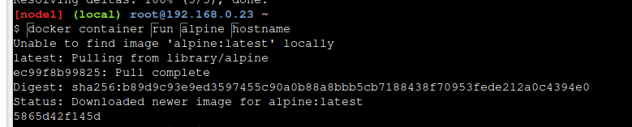  

El siguiente resultado muestra que la imagen alpine:latest no se pudo encontrar localmente. Cuando esto sucede, Docker lo extrae automáticamente de Docker Hub.  

Después de extraer la imagen, se muestra el nombre de host del contenedor (5865d42f145d ).  

2. Docker mantiene un contenedor en ejecución mientras el proceso que inició dentro del contenedor todavía esté ejecutándose. En este caso, el proceso de nombre de host sale tan pronto como se escribe la salida. Esto significa que el contenedor se detiene. Sin embargo, Docker no elimina recursos de forma predeterminada, por lo que el contenedor aún existe en el estado Salido.  

Enumere todos los contenedores.  
```docker container ls --all```  
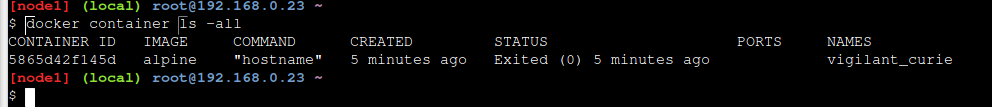  
Observe que su contenedor Alpine Linux está en estado Salido.  
Nota: El ID del contenedor es el nombre de host que mostró el contenedor. En el ejemplo anterior es 5865d42f145d.

Los contenedores que realizan una tarea y luego salen pueden resultar muy útiles. Podrías crear una imagen de Docker que ejecute un script para configurar algo. Cualquiera puede ejecutar esa tarea simplemente ejecutando el contenedor; no necesitan los scripts ni la información de configuración reales.  

* Ejecute un contenedor interactivo de Ubuntu
Puede ejecutar un contenedor basado en una versión de Linux diferente a la que se ejecuta en su host Docker.

En el siguiente ejemplo, vamos a ejecutar un contenedor Ubuntu Linux sobre un host Docker de Alpine Linux (Play With Docker usa Alpine Linux para sus nodos).    

1. Ejecute un contenedor Docker y acceda a su shell.
```docker container run --interactive --tty --rm ubuntu bash```
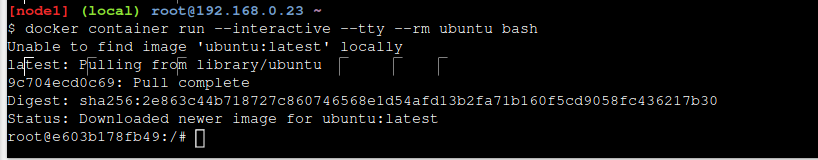  
En este ejemplo, le damos a Docker tres parámetros:

 --interactive dice que deseas una sesión interactiva.  
 --tty asigna un pseudo-tty.  
 --rm le dice a Docker que siga adelante y elimine el contenedor cuando termine de ejecutarse.  

Los dos primeros parámetros le permiten interactuar con el contenedor Docker.

También le estamos diciendo al contenedor que ejecute bash como su proceso principal (PID 1).

Cuando se inicie el contenedor, accederá al shell bash con el mensaje predeterminado root@<container id>:/#. Docker se ha conectado al shell en el contenedor, transmitiendo entrada y salida entre su sesión local y la sesión del shell en el contenedor.

2. Ejecute los siguientes comandos en el contenedor.
```ls /``` enumerará el contenido del directorio raíz en el contenedor, ```ps aux``` mostrará los procesos en ejecución en el contenedor, ```cat /etc/issue``` mostrará qué distribución de Linux está ejecutando el contenedor, en este caso Ubuntu 20.04.3 LTS.  

   
3. Escriba exit para salir de la sesión de shell. Esto finalizará el proceso bash y provocará que el contenedor salga.  
```exit```  
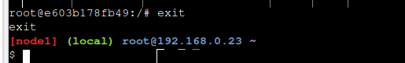   
Nota: Como usamos el indicador --rm cuando iniciamos el contenedor, Docker eliminó el contenedor cuando se detuvo. Esto significa que si ejecuta otro contenedor acoplable ls --all no verá el contenedor de Ubuntu.

Por diversión, verifiquemos la versión de nuestra máquina virtual host.  
```cat /etc/issue```  
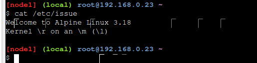   
Tenga en cuenta que nuestra máquina virtual host ejecuta Alpine Linux, pero pudimos ejecutar un contenedor de Ubuntu. Como se mencionó anteriormente, no es necesario que la distribución de Linux dentro del contenedor coincida con la distribución de Linux que se ejecuta en el host Docker.

Sin embargo, los contenedores de Linux requieren que el host Docker ejecute un kernel de Linux. Por ejemplo, los contenedores de Linux no pueden ejecutarse directamente en hosts Docker de Windows. Lo mismo ocurre con los contenedores de Windows: deben ejecutarse en un host Docker con un kernel de Windows.

Los contenedores interactivos son útiles cuando estás creando tu propia imagen. Puede ejecutar un contenedor y verificar todos los pasos que necesita para implementar su aplicación y capturarlos en un Dockerfile.

 Puede enviar un contenedor para crear una imagen a partir de él, pero debe evitarlo siempre que sea posible. Es mucho mejor utilizar un Dockerfile repetible para crear su imagen. Lo verás en breve.

* Ejecutar un contenedor MySQL en segundo plano

Los contenedores en segundo plano son la forma en que ejecutará la mayoría de las aplicaciones. Aquí hay un ejemplo simple usando MySQL.

1. Ejecute un nuevo contenedor MySQL con el siguiente comando.
```docker container run --detach --name mydb -e MYSQL_ROOT_PASSWORD=my – secret – pw mysql:latest```
--detach ejecutará el contenedor en segundo plano.  
 --name lo llamará mydb.  
 -e utilizará una variable de entorno para especificar la contraseña de root (NOTA: esto nunca debe hacerse en producción).  

Como la imagen de MySQL no estaba disponible localmente, Docker la extrajo automáticamente de Docker Hub.  
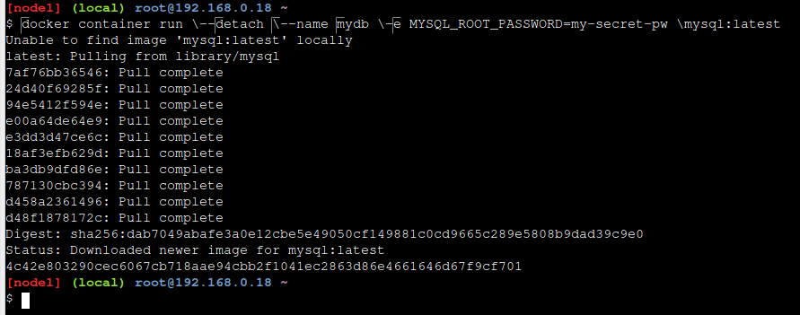  
Mientras el proceso MySQL esté en ejecución, Docker mantendrá el contenedor ejecutándose en segundo plano.  

2. Enumere los contenedores en ejecución.
```docker container ls```
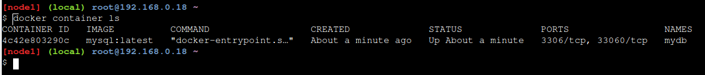  
3. Puede verificar lo que sucede en sus contenedores usando un par de comandos integrados de Docker: docker container logs y docker container top
```docker container logs mydb```
Esto muestra los registros del contenedor MySQL Docker.
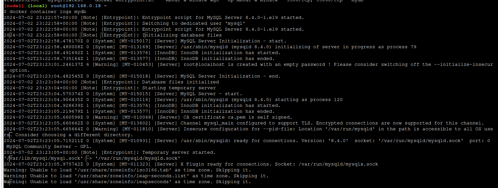  
Veamos los procesos que se ejecutan dentro del contenedor.
```docker container top mydb```
Debería ver que el demonio MySQL (mysqld) se está ejecutando en el contenedor
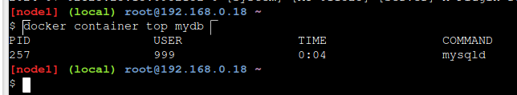  

Aunque MySQL se está ejecutando, está aislado dentro del contenedor porque no se han publicado puertos de red en el host. El tráfico de red no puede llegar a los contenedores desde el host a menos que los puertos se publiquen explícitamente.  

4. Enumere la versión de MySQL usando docker container exec
Docker Container Exec le permite ejecutar un comando dentro de un contenedor. En este ejemplo, usaremos docker container exec para ejecutar el equivalente de línea de comandos de mysql --user=root --password=$MYSQL_ROOT_PASSWORD --version dentro de nuestro contenedor MySQL.  
```docker exec -it mydb mysql --user=root --password=$MYSQL_ROOT_PASSWORD --version```
Verá el número de versión de MySQL, así como una útil advertencia.
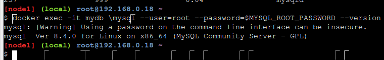
5. También puede utilizar Docker Container Exec para conectarse a un nuevo proceso de shell dentro de un contenedor que ya se está ejecutando. Al ejecutar el siguiente comando, obtendrá un shell interactivo (sh) dentro de su contenedor MySQL.
```docker exec -it mydb sh```
Observe que su indicador de shell ha cambiado. Esto se debe a que su shell ahora está conectado al proceso sh que se ejecuta dentro de su contenedor.
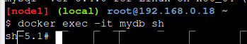
6. Verifiquemos el número de versión ejecutando el mismo comando nuevamente, solo que esta vez desde la nueva sesión de shell en el contenedor.
```mysql --user=root --password=$MYSQL_ROOT_PASSWORD --version```
Observe que el resultado es el mismo que antes.
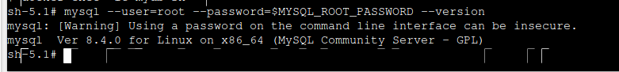
7. Escriba salir para salir de la sesión del shell interactivo.
```exit```
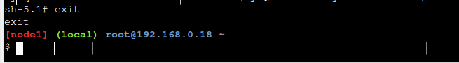

- **Tarea 2: empaquetar y ejecutar una aplicación personalizada usando Docker**
En este paso, aprenderá cómo empaquetar sus propias aplicaciones como imágenes de Docker usando un Dockerfile.
  
La sintaxis de Dockerfile es sencilla. En esta tarea, crearemos un sitio web NGINX simple a partir de un Dockerfile.  

* Cree una imagen de sitio web simple  

Echemos un vistazo al Dockerfile que usaremos, que crea un sitio web simple que le permite enviar un tweet.  

 1. Asegúrate de estar en el directorio linux_tweet_app.  
```cd ~/linux_tweet_app```
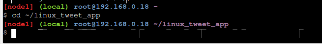
2. Muestra el contenido del Dockerfile.
```cat Dockerfile```
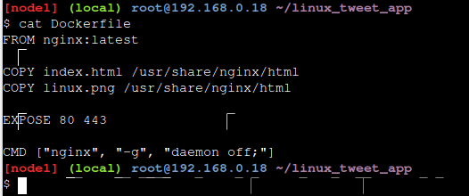
Veamos qué hace cada una de estas líneas en Dockerfile.  

 FROM especifica la imagen base que se utilizará como punto de partida para esta nueva imagen que está creando. Para este ejemplo, comenzamos desde nginx:latest.  
 COPY copia archivos del host Docker a la imagen, en una ubicación conocida. En este ejemplo, COPY se utiliza para copiar dos archivos en la imagen: index.html. y un gráfico que será utilizado en nuestra página web.  
 EXPOSE documenta qué puertos utiliza la aplicación.  
 CMD especifica qué comando ejecutar cuando se inicia un contenedor desde la imagen. Observe que podemos especificar el comando, así como los argumentos en tiempo de ejecución.  

3. Para que los siguientes comandos sean más fáciles de copiar y pegar, exporte una variable de entorno que contenga su DockerID (si no tiene un DockerID, puede obtener uno gratis a través de Docker Hub).  

Tendrá que escribir este comando manualmente, ya que requiere su DockerID único.  
```exportar DOCKERID=<tu docker id>```  
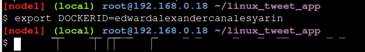  
4. haga eco del valor de la variable al terminal para asegurarse de que se almacenó correctamente.  
```echo $DOCKERID```  
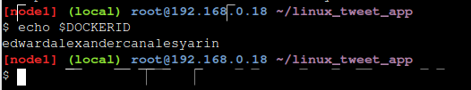  
5. Utilice el comando de creación de imagen de Docker para crear una nueva imagen de Docker siguiendo las instrucciones del Dockerfile.   
```--tag``` nos permite darle un nombre personalizado a la imagen. En este caso se compone de nuestro DockerID, el nombre de la aplicación y una versión. Tener el ID de Docker adjunto al nombre nos permitirá almacenarlo en Docker Hub en un paso posterior.  
 ```.```le dice a Docker que use el directorio actual como contexto de compilación  
Asegúrese de incluir un punto (.) al final del comando.  
```docker image build --tag $DOCKERID/linux_tweet_app:1.0 .```  
El siguiente resultado muestra el demonio Docker ejecutando cada línea en el Dockerfile.  
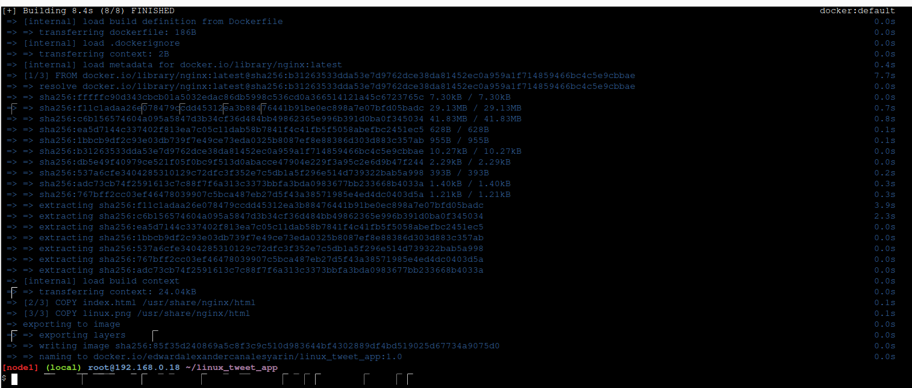  
6. Utilice el comando de ejecución del contenedor Docker para iniciar un nuevo contenedor a partir de la imagen que creó.  

Como este contenedor ejecutará un servidor web NGINX, usaremos el indicador --publish para publicar el puerto 80 dentro del contenedor en el puerto 80 del host. Esto permitirá que el tráfico que ingresa al host de Docker en el puerto 80 se dirija al puerto 80 del contenedor. El formato del indicador --publish es host_port:container_port  
```docker container run --detach --publish 80:80 --name linux_tweet_app $DOCKERID/linux_tweet_app:1.0```  
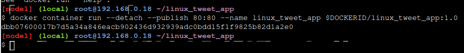  
Cualquier tráfico externo que ingrese al servidor por el puerto 80 ahora se dirigirá al contenedor en el puerto 80.  

En un paso posterior verá cómo mapear el tráfico desde dos puertos diferentes; esto es necesario cuando dos contenedores usan el mismo puerto para comunicarse, ya que solo puede exponer el puerto una vez en el host.  
```docker container run --detach --publish 80:80 --name linux_tweet_app $DOCKERID/linux_tweet_app:1.0```  
7. [Click here to load the website](http://ip172-18-0-21-cq28mp291nsg00bnjks0-80.direct.labs.play-with-docker.com/) que debería estar ejecutándose.  
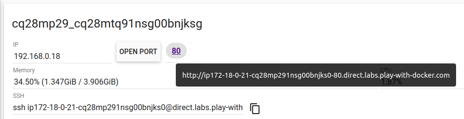  
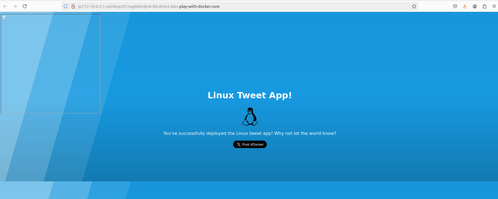  
8. Una vez que haya accedido a su sitio web, ciérrelo y elimínelo.  
```docker container rm --force linux_tweet_app```  
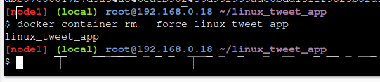  
Nota: Usamos el parámetro --force para eliminar el contenedor en ejecución sin cerrarlo. Esto cerrará el contenedor de forma desagradable y lo eliminará permanentemente del host Docker.  

 En un entorno de producción, es posible que desee utilizar Docker Container Stop para detener correctamente el contenedor y dejarlo en el host. Luego puede usar Docker Container rm para eliminarlo permanentemente.  
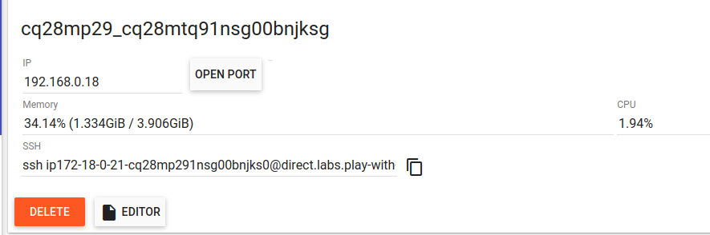  
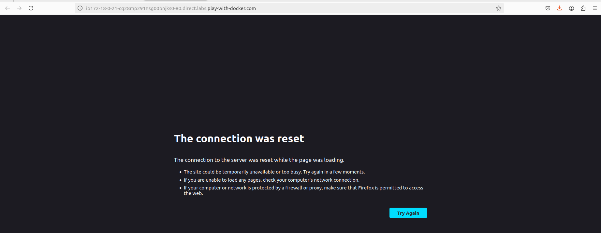  

- **Tarea 3: modificar un sitio web en ejecución**  
Cuando estás trabajando activamente en una aplicación, es inconveniente tener que detener el contenedor, reconstruir la imagen y ejecutar una nueva versión cada vez que realizas un cambio en tu código fuente.  

Una forma de simplificar este proceso es montar el directorio del código fuente en la máquina local en el contenedor en ejecución. Esto permitirá que cualquier cambio realizado en los archivos del host se refleje inmediatamente en el contenedor.  

Hacemos esto usando algo llamado montaje de enlace (bind mount).  

Cuando utiliza un montaje de enlace, un archivo o directorio en la máquina host se monta en un contenedor que se ejecuta en el mismo host.  

* Inicie nuestra aplicación web con un montaje vinculado  

1.  Iniciemos la aplicación web y montemos el directorio actual en el contenedor.  

 En este ejemplo usaremos el indicador --mount para montar el directorio actual en el host en /usr/share/nginx/html dentro del contenedor.  

 Asegúrese de ejecutar este comando desde el directorio linux_tweet_app en su host Docker.  
 ```docker container run --detach --publish 80:80 --name linux_tweet_app --mount type=bind,source="$(pwd)",target=/usr/share/nginx/html $DOCKERID/linux_tweet_app:1.0```   
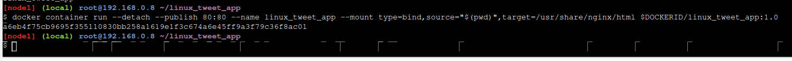  
Recuerde que en Dockerfile, /usr/share/nginx/html es donde se almacenan los archivos html para la aplicación web.  

2. El sitio web debería estar funcionando.
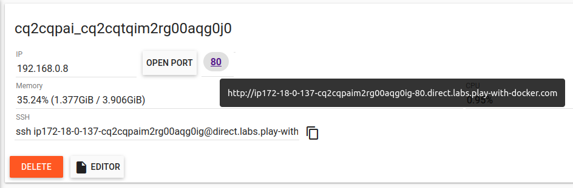
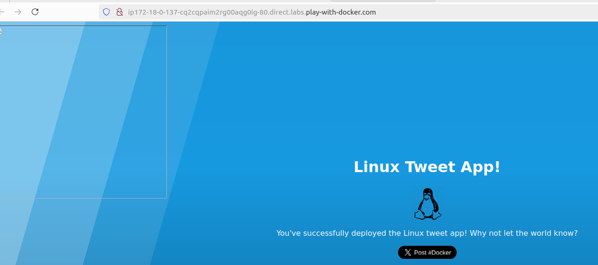
* Modificar el sitio web en ejecución  

Los montajes vinculados significan que cualquier cambio realizado en el sistema de archivos local se refleja inmediatamente en el contenedor en ejecución.  

1. Copie un nuevo index.html en el contenedor.  

 El repositorio de Git que extrajiste anteriormente contiene varias versiones diferentes de un archivo index.html. Puede ejecutar manualmente un comando ls desde el directorio ~/linux_tweet_app para ver una lista de ellos. En este paso reemplazaremos index.html con index-new.html.  
```cp index-new.html index.html```  
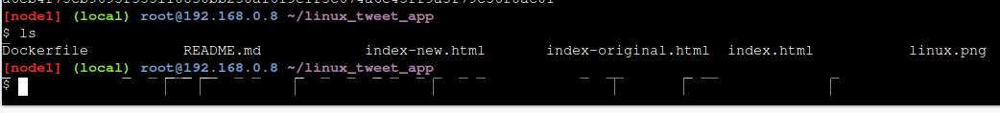  
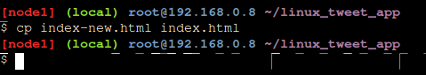   

  
2. Vaya al sitio web en ejecución y actualice la página. Observe que el sitio ha cambiado.  
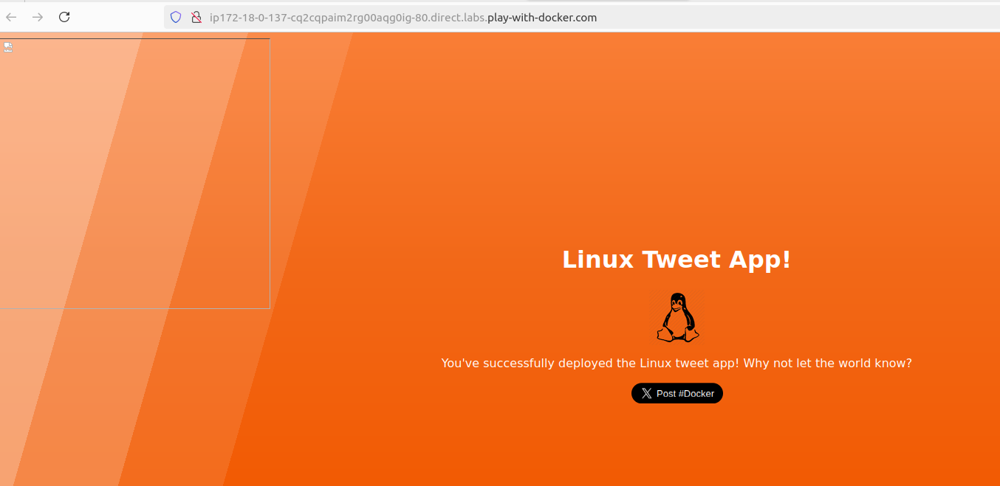
Aunque modificamos el sistema de archivos local index.html y lo vimos reflejado en el contenedor en ejecución, en realidad no cambiamos la imagen de Docker desde la que se inició el contenedor.  

Para mostrar esto, detenga el contenedor actual y vuelva a ejecutar la imagen 1.0 sin un montaje vinculado.  

1. Detenga y elimine el contenedor que se está ejecutando actualmente.
```docker rm --force linux_tweet_app```
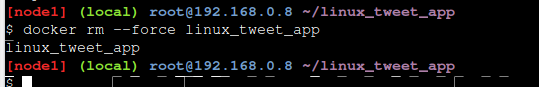
2. Vuelva a ejecutar la versión actual sin un montaje vinculado.
```docker container run --detach --publish 80:80 --name linux_tweet_app $DOCKERID/linux_tweet_app:1.0```
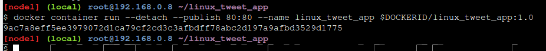
3. Observe que el sitio web ha vuelto a la versión original.
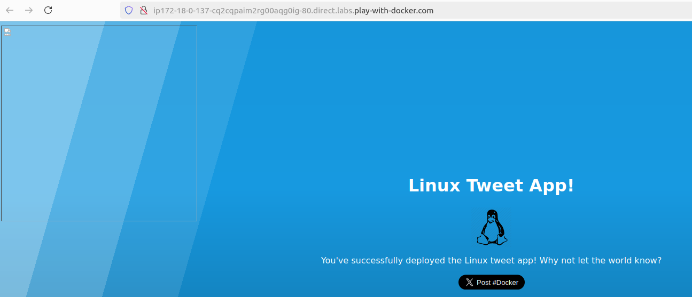
4. Detener y eliminar el contenedor actual
```docker rm --force linux_tweet_app```

* actualizar la imagen  

Para conservar los cambios que realizó en el archivo index.html en la imagen, debe crear una nueva versión de la imagen.  

 Crea una nueva imagen y etiquétala como 2.0  

 Recuerde que previamente modificó el archivo index.html en el sistema de archivos local del host Docker. Esto significa que ejecutar otro comando de compilación de imágenes de Docker creará una nueva imagen con el index.html actualizado.  

 Asegúrese de incluir el punto (.) al final del comando.  
 ```docker image build --tag $DOCKERID/linux_tweet_app:2.0 .```  
   
 ¡Observe lo rápido que se construyó! Esto se debe a que Docker solo modificó la parte de la imagen que cambió en lugar de reconstruir la imagen completa.  


2. Miremos las imágenes del sistema.
```docker image ls```
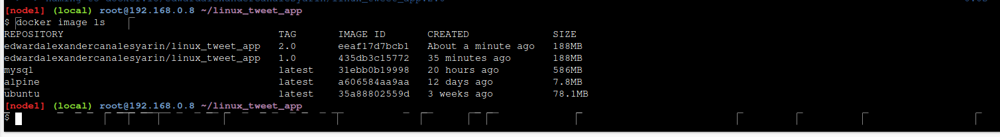
Ahora tienes ambas versiones de la aplicación web en tu host.  

* Prueba la nueva versión  

 1. Ejecute un nuevo contenedor a partir de la nueva versión de la imagen.
```docker container run --detach --publish 80:80 --name linux_tweet_app $DOCKERID/linux_tweet_app:2.0```
2. Verifique la nueva versión del sitio web (es posible que deba actualizar su navegador para que se cargue la nueva versión).  

La página web tendrá un fondo naranja.  
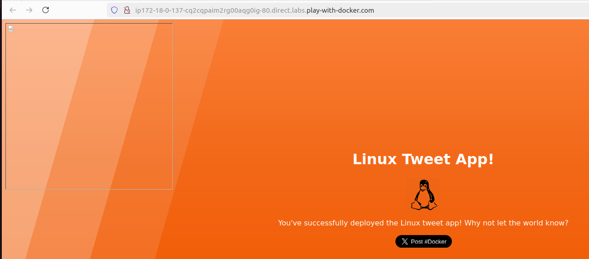  
Podemos ejecutar ambas versiones una al lado de la otra. Lo único que debemos tener en cuenta es que no podemos tener dos contenedores usando el puerto 80 en el mismo host.  

Como ya estamos usando el puerto 80 para el contenedor que se ejecuta desde la versión 2.0 de la imagen, iniciaremos un nuevo contenedor y lo publicaremos en el puerto 8080. Además, debemos darle a nuestro contenedor un nombre único (old_linux_tweet_app)  

3. Ejecute otro contenedor nuevo, esta vez desde la versión anterior de la imagen.  

Observe que este comando asigna el nuevo contenedor al puerto 8080 en el host. Esto se debe a que dos contenedores no pueden asignarse al mismo puerto en un único host Docker.  
```docker container run --detach --publish 8080:80 --name old_linux_tweet_app $DOCKERID/linux_tweet_app:1.0```  
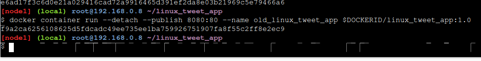   
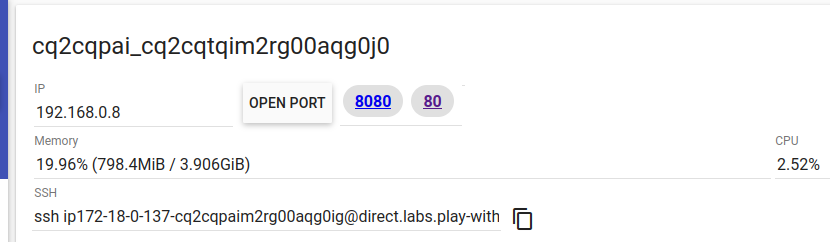   

4. Ver la versión anterior del sitio web.


* Envía tus imágenes a Docker Hub  

1. Enumere las imágenes en su host Docker.
```docker image ls -f reference="$DOCKERID/*"```
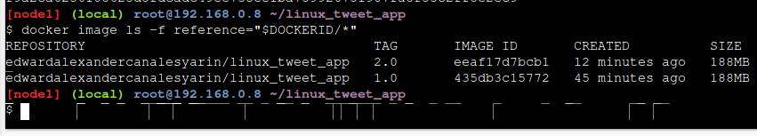
Verás que ahora tienes dos imágenes de linux_tweet_app: una etiquetada como 1.0 y la otra como 2.0.  

Estas imágenes solo se almacenan en el repositorio local de su host Docker. Su host Docker se eliminará después del taller. En este paso, enviaremos las imágenes a un repositorio público para que pueda ejecutarlas desde cualquier máquina Linux con Docker.  

La distribución está integrada en la plataforma Docker. Puede crear imágenes localmente y enviarlas a un registro público o privado, poniéndolas a disposición de otros usuarios. Cualquiera con acceso puede extraer esa imagen y ejecutar un contenedor desde ella. El comportamiento de la aplicación en el contenedor será el mismo para todos, porque la imagen contiene la aplicación completamente configurada; los únicos requisitos para ejecutarla son Linux y Docker.  

Docker Hub es el registro público predeterminado para imágenes de Docker.  

2. Antes de poder enviar sus imágenes, deberá iniciar sesión en Docker Hub.
```docker login```
Deberá proporcionar sus credenciales de ID de Docker cuando se le solicite.
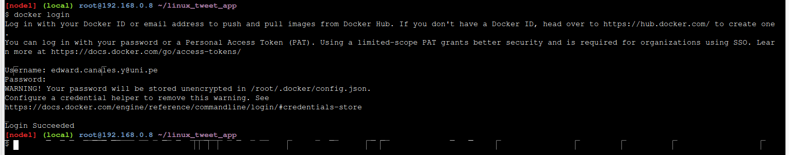

3. Empuje la versión 1.0 de su aplicación web mediante la inserción de imágenes de Docker.
```docker image push $DOCKERID/linux_tweet_app:1.0```
Verá el progreso a medida que la imagen se suba a Docker Hub.
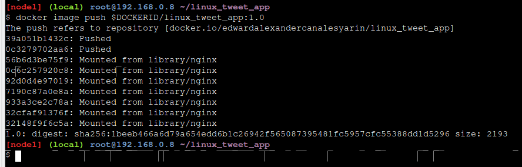

4. Ahora impulse la versión 2.0.
```docker image push $DOCKERID/linux_tweet_app:2.0```  
Observe que varias líneas del resultado dicen que la capa ya existe. Esto se debe a que Docker aprovechará las capas de solo lectura que son iguales a cualquier capa de imagen cargada anteriormente.
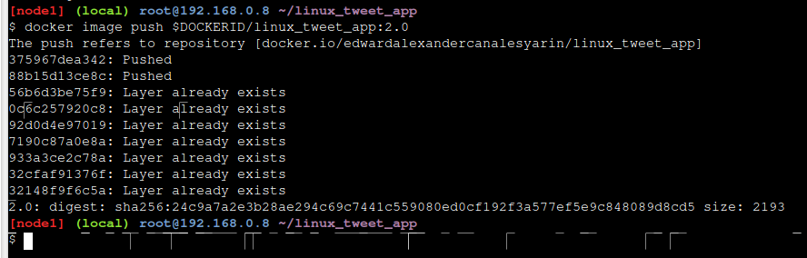

Puede navegar hasta https://hub.docker.com/r/<your docker id>/ y ver las imágenes de Docker recién enviadas. Estos son repositorios públicos, por lo que cualquiera puede extraer la imagen; ni siquiera necesita una ID de Docker para extraer imágenes públicas. Docker Hub también admite repositorios privados.  

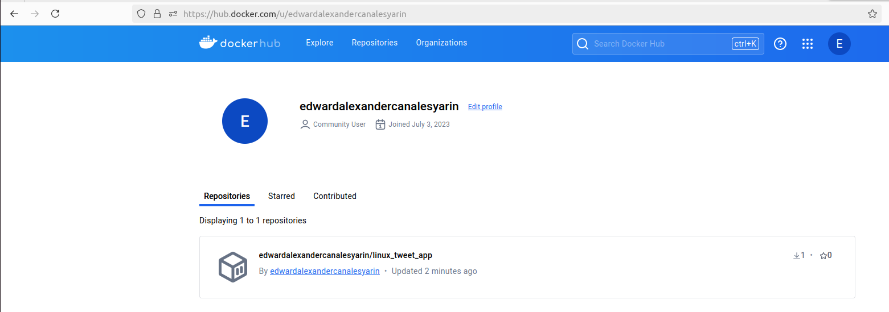  
 


### Stage 2
Esta etapa le muestra cómo  
* Esta etapa le muestra cómo incorporar Docker en todo su flujo de trabajo de desarrollador.  
Laboratorios de escritorio autoguiados  
* Desarrollo en contenedores: aprenda cómo integrar Docker en su IDE  
- [Java Development: Eclipse](https://training.play-with-docker.com/java-debugging-eclipse/)  
- [Java Development: IntelliJ](https://training.play-with-docker.com/java-debugging-intellij/)  
- [Java Development: Netbeans](https://training.play-with-docker.com/java-debugging-netbeans/)  
- [Live Debugging Node.js with Docker and Visual Studio Code](https://training.play-with-docker.com/nodejs-live-debugging/)  
* Contenedores de Windows  
- [Windows Container Setup](https://training.play-with-docker.com/windows-containers-setup/)  
- [Windows Container Basics](https://training.play-with-docker.com/windows-containers-basics/)  
- [Windows Containers Multi-Container Applications](https://training.play-with-docker.com/windows-containers-multicontainer/)  

**DESARROLLO**  

