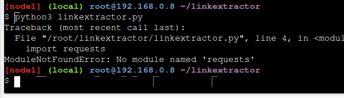
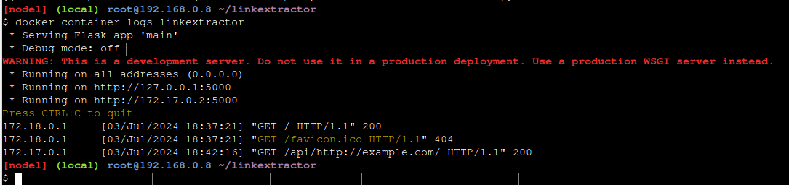
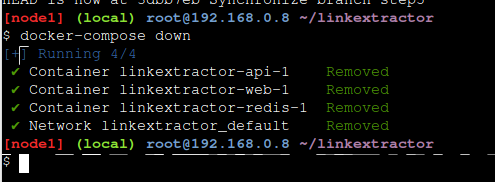

# Actividad PlayDocker
Para iniciar sesión en Play With Docker (PWD) debes tener una cuenta de Docker Hub (en caso de no tener, crear una cuenta [sign up Docker Hub](https://hub.docker.com/signup)), las credenciales de tu cuenta de Docker Hub son las mismas para PWD ([PWD sign in](https://labs.play-with-docker.com/)). Luego de iniciar sesión debe aparecer las siguiente pantallas:  

  
  

Ahora vamos a dirigirnos a PWD classroom ([PWD classroom](https://training.play-with-docker.com/)) donde encontraremos los tutoriales. En esta oportunidad desarrollaré el Stage 1 y 2 del tutorial llamado _Getting Started Walk-through for Developers_:  
## Getting Started Walk-through for Developers
### Stage 1
Esta etapa será  
* Familiarizarse con los conceptos centrales de Docker  
* Mostrarle cómo crear e implementar aplicaciones básicas.
Tutoriales autoguiados en el navegador
- [Docker for Beginners - Linux](https://training.play-with-docker.com/beginner-linux/)  
- [Application Containerization and Microservice Orchestration](https://training.play-with-docker.com/microservice-orchestration/)  
- [Deploying a Multi-Service App in Docker Swarm Mode](https://training.play-with-docker.com/swarm-stack-intro/)  

**DESARROLLO**  
#### Docker for Beginners - Linux
En esta práctica de laboratorio, veremos algunos comandos básicos de Docker y un flujo de trabajo simple de construcción, envío y ejecución. Comenzaremos ejecutando algunos contenedores simples y luego usaremos un Dockerfile para crear una aplicación personalizada. Finalmente, veremos cómo usar montajes de enlace para modificar un contenedor en ejecución como lo haría si estuviera desarrollando activamente usando Docker. Dificultad: principiante (se supone que no está familiarizado con Docker) Tiempo: Aproximadamente 30 minutos  

Tareas:  

- Tarea 0: Requisitos previos  
- Tarea 1: ejecutar algunos contenedores Docker simples  
- Tarea 2: empaquetar y ejecutar una aplicación personalizada usando Docker  
- Tarea 3: modificar un sitio web en ejecución  

**Tarea 0: Requisitos previos**  
- Clonar el repositorio de GitHub del laboratorio
```git clone https://github.com/dockersamples/linux_tweet_app```

  
  

- Asegúrate de tener una DockerID  
Si no tiene un DockerID (un inicio de sesión gratuito utilizado para acceder a Docker Hub), visite Docker Hub y regístrese para obtener uno. Lo necesitará para pasos posteriores. 
Tu nombre de usuario es tu DockerID

**Tarea 1: ejecutar algunos contenedores Docker simples**
Hay diferentes formas de utilizar contenedores. Éstas incluyen:  
* Para ejecutar una sola tarea: podría ser un script de shell o una aplicación personalizada.                   * Interactivamente: esto lo conecta al contenedor de manera similar a la forma en que ingresa mediante SSH a un servidor remoto.  
* En segundo plano: para servicios de larga duración, como sitios web y bases de datos.  

En esta sección probará cada una de esas opciones y verá cómo Docker administra la carga de trabajo  

* **Ejecute una sola tarea en un contenedor Alpine Linux**
En este paso, iniciaremos un nuevo contenedor y le indicaremos que ejecute el comando hostname. El contenedor se iniciará, ejecutará el comando de nombre de host y luego saldrá.  
1. Ejecute el siguiente comando en su consola Linux.  
```docker container run alpine hostname```  

  

El siguiente resultado muestra que la imagen alpine:latest no se pudo encontrar localmente. Cuando esto sucede, Docker lo extrae automáticamente de Docker Hub.  

Después de extraer la imagen, se muestra el nombre de host del contenedor (5865d42f145d ).  

2. Docker mantiene un contenedor en ejecución mientras el proceso que inició dentro del contenedor todavía esté ejecutándose. En este caso, el proceso de nombre de host sale tan pronto como se escribe la salida. Esto significa que el contenedor se detiene. Sin embargo, Docker no elimina recursos de forma predeterminada, por lo que el contenedor aún existe en el estado Salido.  

Enumere todos los contenedores.  
```docker container ls --all```  
  
Observe que su contenedor Alpine Linux está en estado Salido.  
Nota: El ID del contenedor es el nombre de host que mostró el contenedor. En el ejemplo anterior es 5865d42f145d.

Los contenedores que realizan una tarea y luego salen pueden resultar muy útiles. Podrías crear una imagen de Docker que ejecute un script para configurar algo. Cualquiera puede ejecutar esa tarea simplemente ejecutando el contenedor; no necesitan los scripts ni la información de configuración reales.  

* Ejecute un contenedor interactivo de Ubuntu
Puede ejecutar un contenedor basado en una versión de Linux diferente a la que se ejecuta en su host Docker.

En el siguiente ejemplo, vamos a ejecutar un contenedor Ubuntu Linux sobre un host Docker de Alpine Linux (Play With Docker usa Alpine Linux para sus nodos).    

1. Ejecute un contenedor Docker y acceda a su shell.
```docker container run --interactive --tty --rm ubuntu bash```
  
En este ejemplo, le damos a Docker tres parámetros:

 --interactive dice que deseas una sesión interactiva.  
 --tty asigna un pseudo-tty.  
 --rm le dice a Docker que siga adelante y elimine el contenedor cuando termine de ejecutarse.  

Los dos primeros parámetros le permiten interactuar con el contenedor Docker.

También le estamos diciendo al contenedor que ejecute bash como su proceso principal (PID 1).

Cuando se inicie el contenedor, accederá al shell bash con el mensaje predeterminado root@<container id>:/#. Docker se ha conectado al shell en el contenedor, transmitiendo entrada y salida entre su sesión local y la sesión del shell en el contenedor.

2. Ejecute los siguientes comandos en el contenedor.
```ls /``` enumerará el contenido del directorio raíz en el contenedor, ```ps aux``` mostrará los procesos en ejecución en el contenedor, ```cat /etc/issue``` mostrará qué distribución de Linux está ejecutando el contenedor, en este caso Ubuntu 20.04.3 LTS.  

   
3. Escriba exit para salir de la sesión de shell. Esto finalizará el proceso bash y provocará que el contenedor salga.  
```exit```  
   
Nota: Como usamos el indicador --rm cuando iniciamos el contenedor, Docker eliminó el contenedor cuando se detuvo. Esto significa que si ejecuta otro contenedor acoplable ls --all no verá el contenedor de Ubuntu.

Por diversión, verifiquemos la versión de nuestra máquina virtual host.  
```cat /etc/issue```  
   
Tenga en cuenta que nuestra máquina virtual host ejecuta Alpine Linux, pero pudimos ejecutar un contenedor de Ubuntu. Como se mencionó anteriormente, no es necesario que la distribución de Linux dentro del contenedor coincida con la distribución de Linux que se ejecuta en el host Docker.

Sin embargo, los contenedores de Linux requieren que el host Docker ejecute un kernel de Linux. Por ejemplo, los contenedores de Linux no pueden ejecutarse directamente en hosts Docker de Windows. Lo mismo ocurre con los contenedores de Windows: deben ejecutarse en un host Docker con un kernel de Windows.

Los contenedores interactivos son útiles cuando estás creando tu propia imagen. Puede ejecutar un contenedor y verificar todos los pasos que necesita para implementar su aplicación y capturarlos en un Dockerfile.

 Puede enviar un contenedor para crear una imagen a partir de él, pero debe evitarlo siempre que sea posible. Es mucho mejor utilizar un Dockerfile repetible para crear su imagen. Lo verás en breve.

* Ejecutar un contenedor MySQL en segundo plano

Los contenedores en segundo plano son la forma en que ejecutará la mayoría de las aplicaciones. Aquí hay un ejemplo simple usando MySQL.

1. Ejecute un nuevo contenedor MySQL con el siguiente comando.
```docker container run --detach --name mydb -e MYSQL_ROOT_PASSWORD=my – secret – pw mysql:latest```
--detach ejecutará el contenedor en segundo plano.  
 --name lo llamará mydb.  
 -e utilizará una variable de entorno para especificar la contraseña de root (NOTA: esto nunca debe hacerse en producción).  

Como la imagen de MySQL no estaba disponible localmente, Docker la extrajo automáticamente de Docker Hub.  
  
Mientras el proceso MySQL esté en ejecución, Docker mantendrá el contenedor ejecutándose en segundo plano.  

2. Enumere los contenedores en ejecución.
```docker container ls```
  
3. Puede verificar lo que sucede en sus contenedores usando un par de comandos integrados de Docker: docker container logs y docker container top
```docker container logs mydb```
Esto muestra los registros del contenedor MySQL Docker.
  
Veamos los procesos que se ejecutan dentro del contenedor.
```docker container top mydb```
Debería ver que el demonio MySQL (mysqld) se está ejecutando en el contenedor
  

Aunque MySQL se está ejecutando, está aislado dentro del contenedor porque no se han publicado puertos de red en el host. El tráfico de red no puede llegar a los contenedores desde el host a menos que los puertos se publiquen explícitamente.  

4. Enumere la versión de MySQL usando docker container exec
Docker Container Exec le permite ejecutar un comando dentro de un contenedor. En este ejemplo, usaremos docker container exec para ejecutar el equivalente de línea de comandos de mysql --user=root --password=$MYSQL_ROOT_PASSWORD --version dentro de nuestro contenedor MySQL.  
```docker exec -it mydb mysql --user=root --password=$MYSQL_ROOT_PASSWORD --version```
Verá el número de versión de MySQL, así como una útil advertencia.

5. También puede utilizar Docker Container Exec para conectarse a un nuevo proceso de shell dentro de un contenedor que ya se está ejecutando. Al ejecutar el siguiente comando, obtendrá un shell interactivo (sh) dentro de su contenedor MySQL.
```docker exec -it mydb sh```
Observe que su indicador de shell ha cambiado. Esto se debe a que su shell ahora está conectado al proceso sh que se ejecuta dentro de su contenedor.

6. Verifiquemos el número de versión ejecutando el mismo comando nuevamente, solo que esta vez desde la nueva sesión de shell en el contenedor.
```mysql --user=root --password=$MYSQL_ROOT_PASSWORD --version```
Observe que el resultado es el mismo que antes.

7. Escriba salir para salir de la sesión del shell interactivo.
```exit```


- **Tarea 2: empaquetar y ejecutar una aplicación personalizada usando Docker**
En este paso, aprenderá cómo empaquetar sus propias aplicaciones como imágenes de Docker usando un Dockerfile.
  
La sintaxis de Dockerfile es sencilla. En esta tarea, crearemos un sitio web NGINX simple a partir de un Dockerfile.  

* Cree una imagen de sitio web simple  

Echemos un vistazo al Dockerfile que usaremos, que crea un sitio web simple que le permite enviar un tweet.  

 1. Asegúrate de estar en el directorio linux_tweet_app.  
```cd ~/linux_tweet_app```

2. Muestra el contenido del Dockerfile.
```cat Dockerfile```

Veamos qué hace cada una de estas líneas en Dockerfile.  

 FROM especifica la imagen base que se utilizará como punto de partida para esta nueva imagen que está creando. Para este ejemplo, comenzamos desde nginx:latest.  
 COPY copia archivos del host Docker a la imagen, en una ubicación conocida. En este ejemplo, COPY se utiliza para copiar dos archivos en la imagen: index.html. y un gráfico que será utilizado en nuestra página web.  
 EXPOSE documenta qué puertos utiliza la aplicación.  
 CMD especifica qué comando ejecutar cuando se inicia un contenedor desde la imagen. Observe que podemos especificar el comando, así como los argumentos en tiempo de ejecución.  

3. Para que los siguientes comandos sean más fáciles de copiar y pegar, exporte una variable de entorno que contenga su DockerID (si no tiene un DockerID, puede obtener uno gratis a través de Docker Hub).  

Tendrá que escribir este comando manualmente, ya que requiere su DockerID único.  
```exportar DOCKERID=<tu docker id>```  
  
4. haga eco del valor de la variable al terminal para asegurarse de que se almacenó correctamente.  
```echo $DOCKERID```  
  
5. Utilice el comando de creación de imagen de Docker para crear una nueva imagen de Docker siguiendo las instrucciones del Dockerfile.   
```--tag``` nos permite darle un nombre personalizado a la imagen. En este caso se compone de nuestro DockerID, el nombre de la aplicación y una versión. Tener el ID de Docker adjunto al nombre nos permitirá almacenarlo en Docker Hub en un paso posterior.  
 ```.```le dice a Docker que use el directorio actual como contexto de compilación  
Asegúrese de incluir un punto (.) al final del comando.  
```docker image build --tag $DOCKERID/linux_tweet_app:1.0 .```  
El siguiente resultado muestra el demonio Docker ejecutando cada línea en el Dockerfile.  
  
6. Utilice el comando de ejecución del contenedor Docker para iniciar un nuevo contenedor a partir de la imagen que creó.  

Como este contenedor ejecutará un servidor web NGINX, usaremos el indicador --publish para publicar el puerto 80 dentro del contenedor en el puerto 80 del host. Esto permitirá que el tráfico que ingresa al host de Docker en el puerto 80 se dirija al puerto 80 del contenedor. El formato del indicador --publish es host_port:container_port  
```docker container run --detach --publish 80:80 --name linux_tweet_app $DOCKERID/linux_tweet_app:1.0```  
  
Cualquier tráfico externo que ingrese al servidor por el puerto 80 ahora se dirigirá al contenedor en el puerto 80.  

En un paso posterior verá cómo mapear el tráfico desde dos puertos diferentes; esto es necesario cuando dos contenedores usan el mismo puerto para comunicarse, ya que solo puede exponer el puerto una vez en el host.  
```docker container run --detach --publish 80:80 --name linux_tweet_app $DOCKERID/linux_tweet_app:1.0```  
7. [Click here to load the website](http://ip172-18-0-21-cq28mp291nsg00bnjks0-80.direct.labs.play-with-docker.com/) que debería estar ejecutándose.  
  
  
8. Una vez que haya accedido a su sitio web, ciérrelo y elimínelo.  
```docker container rm --force linux_tweet_app```  
  
Nota: Usamos el parámetro --force para eliminar el contenedor en ejecución sin cerrarlo. Esto cerrará el contenedor de forma desagradable y lo eliminará permanentemente del host Docker.  

 En un entorno de producción, es posible que desee utilizar Docker Container Stop para detener correctamente el contenedor y dejarlo en el host. Luego puede usar Docker Container rm para eliminarlo permanentemente.  
  
  

- **Tarea 3: modificar un sitio web en ejecución**  
Cuando estás trabajando activamente en una aplicación, es inconveniente tener que detener el contenedor, reconstruir la imagen y ejecutar una nueva versión cada vez que realizas un cambio en tu código fuente.  

Una forma de simplificar este proceso es montar el directorio del código fuente en la máquina local en el contenedor en ejecución. Esto permitirá que cualquier cambio realizado en los archivos del host se refleje inmediatamente en el contenedor.  

Hacemos esto usando algo llamado montaje de enlace (bind mount).  

Cuando utiliza un montaje de enlace, un archivo o directorio en la máquina host se monta en un contenedor que se ejecuta en el mismo host.  

* Inicie nuestra aplicación web con un montaje vinculado  

1.  Iniciemos la aplicación web y montemos el directorio actual en el contenedor.  

 En este ejemplo usaremos el indicador --mount para montar el directorio actual en el host en /usr/share/nginx/html dentro del contenedor.  

 Asegúrese de ejecutar este comando desde el directorio linux_tweet_app en su host Docker.  
 ```docker container run --detach --publish 80:80 --name linux_tweet_app --mount type=bind,source="$(pwd)",target=/usr/share/nginx/html $DOCKERID/linux_tweet_app:1.0```   
  
Recuerde que en Dockerfile, /usr/share/nginx/html es donde se almacenan los archivos html para la aplicación web.  

2. El sitio web debería estar funcionando.


* Modificar el sitio web en ejecución  

Los montajes vinculados significan que cualquier cambio realizado en el sistema de archivos local se refleja inmediatamente en el contenedor en ejecución.  

1. Copie un nuevo index.html en el contenedor.  

 El repositorio de Git que extrajiste anteriormente contiene varias versiones diferentes de un archivo index.html. Puede ejecutar manualmente un comando ls desde el directorio ~/linux_tweet_app para ver una lista de ellos. En este paso reemplazaremos index.html con index-new.html.  
```cp index-new.html index.html```  
  
   

  
2. Vaya al sitio web en ejecución y actualice la página. Observe que el sitio ha cambiado.  

Aunque modificamos el sistema de archivos local index.html y lo vimos reflejado en el contenedor en ejecución, en realidad no cambiamos la imagen de Docker desde la que se inició el contenedor.  

Para mostrar esto, detenga el contenedor actual y vuelva a ejecutar la imagen 1.0 sin un montaje vinculado.  

1. Detenga y elimine el contenedor que se está ejecutando actualmente.
```docker rm --force linux_tweet_app```

2. Vuelva a ejecutar la versión actual sin un montaje vinculado.
```docker container run --detach --publish 80:80 --name linux_tweet_app $DOCKERID/linux_tweet_app:1.0```

3. Observe que el sitio web ha vuelto a la versión original.

4. Detener y eliminar el contenedor actual
```docker rm --force linux_tweet_app```

* actualizar la imagen  

Para conservar los cambios que realizó en el archivo index.html en la imagen, debe crear una nueva versión de la imagen.  

 Crea una nueva imagen y etiquétala como 2.0  

 Recuerde que previamente modificó el archivo index.html en el sistema de archivos local del host Docker. Esto significa que ejecutar otro comando de compilación de imágenes de Docker creará una nueva imagen con el index.html actualizado.  

 Asegúrese de incluir el punto (.) al final del comando.  
 ```docker image build --tag $DOCKERID/linux_tweet_app:2.0 .```  
   
 ¡Observe lo rápido que se construyó! Esto se debe a que Docker solo modificó la parte de la imagen que cambió en lugar de reconstruir la imagen completa.  


2. Miremos las imágenes del sistema.
```docker image ls```

Ahora tienes ambas versiones de la aplicación web en tu host.  

* Prueba la nueva versión  

 1. Ejecute un nuevo contenedor a partir de la nueva versión de la imagen.
```docker container run --detach --publish 80:80 --name linux_tweet_app $DOCKERID/linux_tweet_app:2.0```
2. Verifique la nueva versión del sitio web (es posible que deba actualizar su navegador para que se cargue la nueva versión).  

La página web tendrá un fondo naranja.  
  
Podemos ejecutar ambas versiones una al lado de la otra. Lo único que debemos tener en cuenta es que no podemos tener dos contenedores usando el puerto 80 en el mismo host.  

Como ya estamos usando el puerto 80 para el contenedor que se ejecuta desde la versión 2.0 de la imagen, iniciaremos un nuevo contenedor y lo publicaremos en el puerto 8080. Además, debemos darle a nuestro contenedor un nombre único (old_linux_tweet_app)  

3. Ejecute otro contenedor nuevo, esta vez desde la versión anterior de la imagen.  

Observe que este comando asigna el nuevo contenedor al puerto 8080 en el host. Esto se debe a que dos contenedores no pueden asignarse al mismo puerto en un único host Docker.  
```docker container run --detach --publish 8080:80 --name old_linux_tweet_app $DOCKERID/linux_tweet_app:1.0```  
   
   

4. Ver la versión anterior del sitio web.


* Envía tus imágenes a Docker Hub  

1. Enumere las imágenes en su host Docker.
```docker image ls -f reference="$DOCKERID/*"```

Verás que ahora tienes dos imágenes de linux_tweet_app: una etiquetada como 1.0 y la otra como 2.0.  

Estas imágenes solo se almacenan en el repositorio local de su host Docker. Su host Docker se eliminará después del taller. En este paso, enviaremos las imágenes a un repositorio público para que pueda ejecutarlas desde cualquier máquina Linux con Docker.  

La distribución está integrada en la plataforma Docker. Puede crear imágenes localmente y enviarlas a un registro público o privado, poniéndolas a disposición de otros usuarios. Cualquiera con acceso puede extraer esa imagen y ejecutar un contenedor desde ella. El comportamiento de la aplicación en el contenedor será el mismo para todos, porque la imagen contiene la aplicación completamente configurada; los únicos requisitos para ejecutarla son Linux y Docker.  

Docker Hub es el registro público predeterminado para imágenes de Docker.  

2. Antes de poder enviar sus imágenes, deberá iniciar sesión en Docker Hub.
```docker login```
Deberá proporcionar sus credenciales de ID de Docker cuando se le solicite.


3. Empuje la versión 1.0 de su aplicación web mediante la inserción de imágenes de Docker.
```docker image push $DOCKERID/linux_tweet_app:1.0```
Verá el progreso a medida que la imagen se suba a Docker Hub.


4. Ahora impulse la versión 2.0.
```docker image push $DOCKERID/linux_tweet_app:2.0```  
Observe que varias líneas del resultado dicen que la capa ya existe. Esto se debe a que Docker aprovechará las capas de solo lectura que son iguales a cualquier capa de imagen cargada anteriormente.


Puede navegar hasta ```https://hub.docker.com/r/<your docker id>/``` y ver las imágenes de Docker recién enviadas. Estos son repositorios públicos, por lo que cualquiera puede extraer la imagen; ni siquiera necesita una ID de Docker para extraer imágenes públicas. Docker Hub también admite repositorios privados.  

  
 
#### Application Containerization and Microservice Orchestration
Pasos:  

 Configuración del escenario  
 Paso 0: Script básico de extracción de enlaces  
 Paso 1: Script de extracción de enlaces en contenedores  
 Paso 2: Módulo extractor de enlaces con URI completo y texto ancla  
 Paso 3: Servicio API Link Extractor  
 Paso 4: API de Link Extractor y servicios de interfaz web  
 Paso 5: Servicio Redis para almacenamiento en caché  
 Paso 6: intercambie el servicio API de Python con Ruby  
 Conclusiones  

**Configuración del escenario**  
```git clone https://github.com/ibnesayeed/linkextractor.git```
```cd linkextractor```
```git checkout demo```
  

**Paso 0: Script básico de extracción de enlaces**  
Consulte la rama step0 y enumere los archivos que contiene.  
```git checkout step0```  
```tree```
  

El archivo linkextractor.py es el interesante aquí, así que veamos su contenido:  
```cat linkextractor.py```  
  
Este es un script Python simple que importa tres paquetes: sys de la biblioteca estándar y dos solicitudes populares de paquetes de terceros y bs4. El argumento de línea de comando proporcionado por el usuario (que se espera que sea una URL a una página HTML) se usa para recuperar la página usando el paquete de solicitudes y luego se analiza usando BeautifulSoup. Luego, el objeto analizado se repite para encontrar todos los elementos de anclaje (es decir, etiquetas <a>) e imprimir el valor de su atributo href que contiene el hipervínculo.  

Sin embargo, este script aparentemente simple puede no ser el más fácil de ejecutar en una máquina que no cumple con sus requisitos. El archivo README.md sugiere cómo ejecutarlo, así que intentémoslo:  
```./linkextractor.py http://example.com/```  

  
Cuando intentamos ejecutarlo como un script, obtuvimos el error Permiso denegado. Comprobemos los permisos actuales de este archivo:  
```ls -l linkextractor.py```  
  

Este permiso actual -rw-r--r-- indica que el script no está configurado para ser ejecutable. Podemos cambiarlo ejecutando chmod a+x linkextractor.py o ejecutarlo como un programa Python en lugar de un script autoejecutable como se ilustra a continuación:  
```python3 linkextractor.py```  
  
Aquí recibimos el primer mensaje ImportError porque nos falta el paquete de terceros que necesita el script. Podemos instalar ese paquete de Python (y potencialmente otros paquetes faltantes) usando una de las muchas técnicas para hacerlo funcionar, pero es demasiado trabajo para un script tan simple, lo que puede no ser obvio para aquellos que no están familiarizados con el ecosistema de Python.  

Dependiendo de en qué máquina y sistema operativo esté intentando ejecutar este script, qué software ya está instalado y cuánto acceso tenga, puede enfrentar algunas de estas posibles dificultades:  

 ¿El script es ejecutable?  
 ¿Está Python instalado en la máquina?  
 ¿Puedes instalar software en la máquina?  
 ¿Está instalado el pip?  
 ¿Están instaladas las solicitudes y las bibliotecas de Python beautifulsoup4?  

Aquí es donde las herramientas de contenedorización de aplicaciones como Docker resultan útiles. En el siguiente paso intentaremos contener este script y hacerlo más fácil de ejecutar.  

**Paso 1: Script de extracción de enlaces en contenedores**  
Consulte la rama del paso 1 y enumere los archivos que contiene.  
```
git checkout step1
tree
```
  
Hemos agregado un archivo nuevo (es decir, Dockerfile) en este paso. Veamos su contenido:  
```cat Dockerfile```  
  
Usando este Dockerfile podemos preparar una imagen de Docker para este script. Comenzamos con la imagen oficial de Python Docker que contiene el entorno de ejecución de Python, así como las herramientas necesarias para instalar paquetes y dependencias de Python. Luego agregamos algunos metadatos como etiquetas (este paso no es esencial, pero de todos modos es una buena práctica). Las siguientes dos instrucciones ejecutan el comando pip install para instalar los dos paquetes de terceros necesarios para que el script funcione correctamente. Luego creamos un directorio de trabajo/aplicación, copiamos el archivo linkextractor.py en él y cambiamos sus permisos para convertirlo en un script ejecutable. Finalmente, configuramos el script como punto de entrada para la imagen.  

Hasta ahora, acabamos de describir cómo queremos que sea nuestra imagen de Docker, pero en realidad no creamos una. Así que hagamos precisamente eso:  
```docker image build -t linkextractor:step1 .```  
  
Hemos creado una imagen de Docker llamada linkextractor:step1 basada en el Dockerfile ilustrado arriba. Si la compilación fue exitosa, deberíamos poder verla en la lista de imágenes:  

```docker image ls```  
  
Esta imagen debe tener todos los ingredientes necesarios empaquetados para ejecutar el script en cualquier lugar de una máquina que admita Docker. Ahora, ejecutemos un contenedor único con esta imagen y extraigamos enlaces de algunas páginas web activas:  

```docker container run -it --rm linkextractor:step1 http://example.com/
```

Esto genera un único enlace que está presente en la [página web](http://www.iana.org/domains/example) simple example.com:  
  
  

Probémoslo en una página web con más enlaces:  
```docker container run -it --rm linkextractor:step1 https://training.play-with-docker.com/```  
  

Esto se ve bien, pero podemos mejorar el resultado. Por ejemplo, algunos enlaces son relativos, podemos convertirlos en URL completas y también proporcionar el texto ancla al que están vinculados. En el siguiente paso realizaremos estos cambios y algunas otras mejoras al script.  

**Paso 2: Módulo extractor de enlaces con URI completo y texto ancla**  
Consulte la rama del paso 2 y enumere los archivos que contiene. 
```
git checkout step2
tree
```
  

En este paso, el script linkextractor.py se actualiza con los siguientes cambios funcionales:  

- Las rutas están normalizadas a URL completas.  
- Informar tanto de enlaces como de textos de anclaje  
- Utilizable como módulo en otros scripts.   

Echemos un vistazo al script actualizado:  

```cat linkextractor.py```  
  

La lógica de extracción de enlaces se resume en una función extract_links que acepta una URL como parámetro y devuelve una lista de objetos que contienen textos de anclaje e hipervínculos normalizados. Esta funcionalidad ahora se puede importar a otros scripts como un módulo (que utilizaremos en el siguiente paso).  

Ahora, creemos una nueva imagen y veamos estos cambios en efecto:  

```docker image build -t linkextractor:step2 .```  
  

Hemos utilizado una nueva etiqueta linkextractor:step2 para esta imagen para no sobrescribir la imagen del paso1 para ilustrar que pueden coexistir y que los contenedores se pueden ejecutar usando cualquiera de estas imágenes.  
```docker image ls```  
  

Running a one-off container using the linkextractor:step2 image should now yield an improved output:  
```docker container run -it --rm linkextractor:step2 https://training.play-with-docker.com/```  

  

Ejecutar un contenedor usando la imagen anterior linkextractor:step1 aún debería generar el resultado anterior:  ```docker container run -it --rm linkextractor:step1 https://training.play-with-docker.com/```  
  
Hasta ahora, hemos aprendido cómo contener un script con sus dependencias necesarias para hacerlo más portátil. También aprendimos cómo realizar cambios en la aplicación y crear diferentes variantes de imágenes de Docker que pueden coexistir. En el siguiente paso, crearemos un servicio web que utilizará este script y hará que el servicio se ejecute dentro de un contenedor Docker.  

**Paso 3: Servicio API Link Extractor**  
Consulte la rama del paso 3 y enumere los archivos que contiene. 
```
git checkout step3
tree
```
  

En este paso se han realizado los siguientes cambios:

- Se agregó un script de servidor main.py que utiliza el módulo de extracción de enlaces escrito en el último paso.  
- El Dockerfile se actualiza para hacer referencia al archivo main.py.  
- Se puede acceder al servidor como API WEB en ```http://<hostname>[:<prt>]/api/<url>```  
- Las dependencias se mueven al archivo requisitos.txt.  
- Necesita mapeo de puertos para que el servicio sea accesible fuera del contenedor (el servidor Flask usado aquí escucha en el puerto 5000 de forma predeterminada)  

Primero veamos el Dockerfile para ver los cambios:  
```cat Dockerfile```  
  
Desde que comenzamos a usar requisitos.txt para dependencias, ya no necesitamos ejecutar el comando pip install para paquetes individuales. La directiva ENTRYPOINT se reemplaza con CMD y se refiere al script main.py que tiene el código del servidor porque ahora no queremos usar esta imagen para comandos únicos.  

El módulo linkextractor.py permanece sin cambios en este paso, así que veamos el archivo main.py recién agregado:  
```cat main.py```  
  

Aquí, importamos la función extract_links del módulo linkextractor y convertimos la lista de objetos devuelta en una respuesta JSON.  

Es hora de crear una nueva imagen con estos cambios implementados:  

```docker image build -t linkextractor:step3 .```  
  

Luego ejecute el contenedor en modo separado (indicador -d) para que la terminal esté disponible para otros comandos mientras el contenedor aún se está ejecutando. Tenga en cuenta que estamos asignando el puerto 5000 del contenedor con el 5000 del host (usando el argumento -p 5000:5000) para que sea accesible desde el host. También asignamos un nombre (--name=linkextractor) al contenedor para que sea más fácil ver los registros y eliminar o eliminar el contenedor.  

```docker container run -d -p 5000:5000 --name=linkextractor linkextractor:step3```
  
  

Si todo va bien, deberíamos poder ver el contenedor listado en condición Arriba:  
```docker container ls```  
  

Ahora podemos realizar una solicitud HTTP en el formato ```/api/<url>``` para hablar con este servidor y obtener la respuesta que contiene los enlaces extraídos:

``` curl -i http://localhost:5000/api/http://example.com/```   
  

Ahora, tenemos el servicio API en ejecución que acepta solicitudes en el formato ```/api/<url>``` y responde con un JSON que contiene hipervínculos y textos de anclaje de todos los enlaces presentes en la página web en ```<url>```.  

Dado que el contenedor se ejecuta en modo separado, no podemos ver lo que sucede dentro, pero podemos ver los registros usando el nombre linkextractor que asignamos a nuestro contenedor:  

```docker container logs linkextractor```  
  

Podemos ver los mensajes registrados cuando se activó el servidor y una entrada del registro de solicitudes cuando ejecutamos el comando curl. Ahora podemos matar y eliminar este contenedor:  

```docker container rm -f linkextractor```  
  

En este paso hemos ejecutado exitosamente un servicio API escuchando en el puerto 5000. Esto es genial, pero las API y las respuestas JSON son para máquinas, por lo que en el siguiente paso ejecutaremos un servicio web con una interfaz web amigable para los humanos además de esto. Servicio API.  

**Paso 4: API de Link Extractor y servicios de interfaz web**  
Consulte la rama del paso 4 y enumere los archivos que contiene.  
```
git checkout step4
tree
```
  

En este paso se han realizado los siguientes cambios desde el último paso:  

 El servicio API JSON del extractor de enlaces (escrito en Python) se mueve a una carpeta ./api separada que tiene exactamente el mismo código que en el paso anterior.
 Una aplicación web front-end está escrita en PHP en la carpeta ./www que se comunica con la API JSON.
 La aplicación PHP está montada dentro de la imagen oficial de Docker php:7-apache para facilitar su modificación durante el desarrollo.  
 Se puede acceder a la aplicación web en ```http://<hostname>[:<prt>]/?url=<url-encoded-url>```
 Se utiliza una variable de entorno API_ENDPOINT dentro de la aplicación PHP para configurarla para comunicarse con el servidor API JSON.
 Se escribe un archivo ```docker-compose.yml``` para construir varios componentes y unirlos.

En este paso planeamos ejecutar dos contenedores separados, uno para la API y el otro para la interfaz web. Este último necesita una forma de comunicarse con el servidor API. Para que los dos contenedores puedan comunicarse entre sí, podemos asignar sus puertos en la máquina host y usarlos para el enrutamiento de solicitudes o podemos colocar los contenedores en una única red privada y acceder directamente. Docker tiene un excelente soporte para redes y proporciona comandos útiles para manejar redes. Además, en una red Docker los contenedores se identifican usando sus nombres como nombres de host para evitar buscar sus direcciones IP en la red privada. Sin embargo, no haremos nada de esto manualmente, sino que usaremos Docker Compose para automatizar muchas de estas tareas.  

Entonces, veamos el archivo ```docker-compose.yml``` que tenemos:  

```cat docker-compose.yml```  
  

Este es un archivo YAML simple que describe los dos servicios api y web. El servicio API utilizará la imagen linkextractor-api:step4-python que aún no está creada, pero que se creará bajo demanda utilizando el Dockerfile del directorio ./api. Este servicio estará expuesto en el puerto 5000 del host.  

El segundo servicio llamado web utilizará la imagen oficial de php:7-apache directamente desde DockerHub, es por eso que no tenemos un Dockerfile para él. El servicio estará expuesto en el puerto HTTP predeterminado (es decir, 80). Proporcionaremos una variable de entorno denominada API_ENDPOINT con el valor ```http://api:5000/api/``` para indicarle al script PHP dónde conectarse para acceder a la API. Tenga en cuenta que aquí no estamos usando una dirección IP; en su lugar, se usa api:5000 porque tendremos una entrada de nombre de host dinámico en la red privada para el servicio API que coincide con su nombre de servicio. Finalmente, montaremos la carpeta ```./www``` para que el archivo index.php esté disponible dentro del contenedor del servicio web en ```/var/www/html```, que es la raíz web predeterminada para el servidor web Apache.  

Ahora, echemos un vistazo al archivo www/index.php de cara al usuario:  

```cat www/index.php```  

Este es un archivo largo que contiene principalmente todas las marcas y estilos de la página. Sin embargo, el bloque de código importante se encuentra al principio del archivo, como se ilustra a continuación:  
   

La variable $api_endpoint se inicializa con el valor de la variable de entorno proporcionada desde el archivo ``` docker-compose.yml```  como ``` $_ENV["API_ENDPOINT"]```  (de lo contrario, vuelve a un valor predeterminado de ``` http://localhost:5000/api/)```  . La solicitud se realiza mediante la función file_get_contents que utiliza la variable $api_endpoint y la URL proporcionada por el usuario desde ``` ``` ```$_GET["url"]```. Se realizan algunos análisis y transformaciones en la respuesta recibida que luego se utilizan en el marcado para completar la página.  

Activemos estos servicios en modo independiente usando la utilidad docker-compose:  
```docker-compose up -d --build```  
  

Este resultado muestra que Docker Compose creó automáticamente una red llamada linkextractor_default, extrajo la imagen php:7-apache de DockerHub, creó la imagen api:python usando nuestro Dockerfile local y, finalmente, activó dos contenedores linkextractor_web_1 y linkextractor_api_1 que corresponden a los dos servicios que tenemos. definido en el archivo YAML anterior.  

Verificar la lista de contenedores en ejecución confirma que los dos servicios efectivamente se están ejecutando:  

```docker container ls```  
  

Ahora deberíamos poder hablar con el servicio API como antes:  
```curl -i http://localhost:5000/api/http://example.com/```  
  

Para acceder a la interfaz web, haga clic para abrir Link Extractor. Luego complete el formulario con https://training.play-with-docker.com/ (o cualquier URL de página HTML de su elección) y envíelo para extraer enlaces del mismo.

Acabamos de crear una aplicación con arquitectura de microservicio, aislando tareas individuales en servicios separados en lugar de aplicaciones monolíticas donde todo se reúne en una sola unidad. Las aplicaciones de microservicios son relativamente más fáciles de escalar, mantener y mover. También permiten un fácil intercambio de componentes con un servicio equivalente. Más sobre eso más adelante.

Ahora, modifiquemos el archivo www/index.php para reemplazar todas las apariciones de Link Extractor con Super Link Extractor:  
```sed -i 's/Link Extractor/Super Link Extractor/g' www/index.php```  
  

Recargar la interfaz web de la aplicación, ahora debería reflejar este cambio en el título, encabezado y pie de página. Esto sucede porque la carpeta ./www está montada dentro del contenedor, por lo que cualquier cambio realizado fuera se reflejará dentro del contenedor o viceversa. Este enfoque es muy útil en el desarrollo, pero en el entorno de producción preferiríamos que nuestras imágenes de Docker fueran autónomas. Reviertamos estos cambios ahora para limpiar el seguimiento de Git:  
```git reset --hard```  

  

Antes de pasar al siguiente paso, debemos cerrar estos servicios, pero Docker Compose puede ayudarnos a solucionarlo muy fácilmente:  

```docker-compose down```  
  

En el siguiente paso, agregaremos un servicio más a nuestra pila y crearemos una imagen personalizada e independiente para nuestro servicio de interfaz web.  

**Paso 5: Servicio Redis para almacenamiento en caché** 
Consulte la rama del paso 5 y enumere los archivos que contiene.  
```
git checkout step5
tree
```

  

Algunos cambios notables con respecto al paso anterior son los siguientes:

- Se agrega otro Dockerfile en la carpeta ./www para que la aplicación web PHP cree una imagen autónoma y evite el montaje de archivos en vivo.  
- Se agrega un contenedor Redis para almacenamiento en caché usando la imagen oficial de Redis Docker  
- El servicio API se comunica con el servicio Redis para evitar descargar y analizar páginas que ya se eliminaron antes.  
- Se agrega una variable de entorno REDIS_URL al servicio API para permitirle conectarse al caché de Redis.  

Primero inspeccionemos el Dockerfile recién agregado en la carpeta ```./www```:  

```cat www/Dockerfile```  
  

Este es un Dockerfile bastante simple que utiliza la imagen oficial de php:7-apache como base y copia todos los archivos de la carpeta ./www en la carpeta /var/www/html/ de la imagen. Esto es exactamente lo que estaba sucediendo en el paso anterior, pero se montó mediante enlace usando un volumen, mientras que aquí hacemos que el código forme parte de la imagen independiente. También agregamos aquí la variable de entorno API_ENDPOINT con un valor predeterminado, lo que implícitamente sugiere que esta es una información importante que debe estar presente para que el servicio funcione correctamente (y debe personalizarse en tiempo de ejecución con un valor apropiado).  

A continuación, veremos el archivo ``` api/main.py```  del servidor API donde utilizamos el caché de Redis:  
```cat api/main.py```  

  
El archivo tiene muchas líneas, pero los bits importantes se ilustran a continuación:  

 

Esta vez, el servicio API necesita saber cómo conectarse a la instancia de Redis, ya que la utilizará para el almacenamiento en caché. Esta información puede estar disponible en tiempo de ejecución utilizando la variable de entorno REDIS_URL. También se agrega una entrada ENV correspondiente en el Dockerfile del servicio API con un valor predeterminado.  

Se crea una instancia de cliente Redis utilizando el nombre de host redis (el mismo que el nombre del servicio, como veremos más adelante) y el puerto predeterminado de Redis 6379. Primero intentamos ver si hay un caché presente en el almacén de Redis para una URL determinada. , si no, usamos la función extract_links como antes y completamos el caché para futuros intentos.  

Ahora, veamos el archivo docker-compose.yml actualizado:  

```cat docker-compose.yml```  
  

La configuración del servicio API sigue siendo en gran medida la misma que antes, excepto la etiqueta de imagen actualizada y la variable de entorno REDIS_URL agregada que apunta al servicio Redis. Para el servicio web, estamos utilizando la imagen personalizada linkextractor-web:step5-php que se creará utilizando el Dockerfile recién agregado en la carpeta ./www. Ya no montamos la carpeta ./www usando la configuración de volúmenes. Finalmente, se agrega un nuevo servicio llamado redis que utilizará la imagen oficial de DockerHub y no necesita configuraciones específicas por ahora. La API de Python puede acceder a este servicio utilizando su nombre de servicio, de la misma manera que el servicio de interfaz de usuario de PHP puede acceder al servicio API.  

Iniciemos estos servicios:  

```docker-compose up -d --build```  
   

Ahora que los tres servicios están activos, acceda a la interfaz web haciendo clic en Link Extractor. No debe haber ninguna diferencia visual con respecto al paso anterior. Sin embargo, si extrae enlaces de una página con muchos enlaces, la primera vez debería llevar más tiempo, pero los intentos sucesivos a la misma página deberían devolver la respuesta con bastante rapidez. Para verificar si se está utilizando o no el servicio Redis, podemos usar docker-compose exec seguido del nombre del servicio redis y el comando monitor de la CLI de Redis:  

```docker-compose exec redis redis-cli monitor```  

   

Ahora, intente extraer enlaces de algunas páginas web utilizando la interfaz web y observe la diferencia en las entradas del registro de Redis para las páginas que se eliminan la primera vez y las que se repiten. Antes de continuar con el tutorial, detenga la transmisión del monitor interactivo como resultado del comando redis-cli anterior presionando las teclas Ctrl + C mientras el terminal interactivo está enfocado.  

Ahora que no estamos montando la carpeta /www dentro del contenedor, los cambios locales no deberían reflejarse en el servicio en ejecución:  

```sed -i 's/Link Extractor/Super Link Extractor/g' www/index.php```  
   

Verifique que los cambios realizados localmente no se reflejen en el servicio en ejecución recargando la interfaz web y luego revierta los cambios:  

```git reset --hard```  
  

Ahora, cierre estos servicios y prepárese para el siguiente paso:  

```docker-compose down```  

  

Hemos orquestado con éxito tres microservicios para componer nuestra aplicación Link Extractor. Ahora tenemos una pila de aplicaciones que representa la arquitectura ilustrada en la figura que se muestra en la introducción de este tutorial. En el siguiente paso exploraremos lo fácil que es intercambiar componentes de una aplicación con la arquitectura de microservicio.  

**Paso 6: intercambie el servicio API de Python con Ruby**  
Consulte la rama del paso 6 y enumere los archivos que contiene.  
```
git checkout step6
tree
```
  

Algunos cambios significativos con respecto al paso anterior incluyen:  

- El servicio API escrito en Python se reemplaza con una implementación similar de Ruby  
- La variable de entorno API_ENDPOINT se actualiza para apuntar al nuevo servicio API de Ruby.  
- El evento de caché de extracción de enlaces (HIT/MISS) se registra y persiste mediante volúmenes  

Observe que la carpeta ./api no contiene ningún script de Python; en cambio, ahora tiene un archivo Ruby y un Gemfile para administrar las dependencias.  

Hagamos un recorrido rápido por los archivos modificados:  

```cat api/linkextractor.rb```  
  

Este archivo Ruby es casi equivalente a lo que teníamos antes en Python, excepto que, además, también registra las solicitudes de extracción de enlaces y los eventos de caché correspondientes. En una aplicación de arquitectura de microservicio, intercambiar componentes por uno equivalente es fácil siempre que se mantengan las expectativas de los consumidores del componente.  

```cat api/Dockerfile```  
  

El Dockerfile anterior está escrito para el script Ruby y se explica por sí mismo.  

```cat docker-compose.yml```  
  

El archivo docker-compose.yml tiene algunos cambios menores. La imagen del servicio API ahora se denomina linkextractor-api:step6-ruby, la asignación del puerto se cambia de 5000 a 4567 (que es el puerto predeterminado para el servidor Sinatra) y la variable de entorno API_ENDPOINT en el servicio web se actualiza en consecuencia para que el El código PHP puede comunicarse con él.  

Una vez implementado esto, iniciemos nuestra pila de servicios:  

```docker-compose up -d --build```  
   

Ahora deberíamos poder acceder a la API (usando el número de puerto actualizado):  
```curl -i http://localhost:4567/api/http://example.com/```  

  

Ahora, abra la interfaz web haciendo clic en Link Extractor y extraiga enlaces de algunas URL. Además, intente repetir estos intentos para algunas URL. Si todo está bien, la aplicación web debería comportarse como antes sin notar ningún cambio en el servicio API (que queda completamente reemplazado).  

Podemos usar el comando tail con la opción -f o --follow para seguir la salida del registro en vivo.  

```tail -f logs/extraction.log```  

  

Pruebe algunas URL más en la interfaz web. Debería ver aparecer las nuevas entradas de registro en la terminal.

Para dejar de seguir el registro, presione las teclas Ctrl + C mientras el terminal interactivo está enfocado.

Podemos cerrar la pila ahora:  

```docker-compose down```  
  

Dado que tenemos registros persistentes, aún deberían estar disponibles después de que desaparezcan los servicios:  

```cat logs/extraction.log```  
  

Esto ilustra que el almacenamiento en caché funciona ya que el segundo intento de http://example.com/ resultó en un HIT de caché.  

En este paso exploramos la posibilidad de intercambiar componentes de una aplicación con arquitectura de microservicio con sus equivalentes sin afectar el resto de las partes de la pila. También hemos explorado la persistencia de datos utilizando volúmenes de montaje vinculados que persisten incluso después de que los contenedores que escriben en el volumen desaparezcan.  

Hasta ahora, hemos utilizado la utilidad docker-compose para organizar la pila de aplicaciones, lo cual es bueno para el entorno de desarrollo, pero para el entorno de producción utilizamos el comando docker stack desplegar para ejecutar la aplicación en un Docker Swarm Cluster. Le queda como tarea implementar esta aplicación en un Docker Swarm Cluster.  

**Conclusiones**  
Comenzamos este tutorial con un script Python simple que extrae enlaces de la URL de una página web determinada. Demostramos varias dificultades al ejecutar el script. Luego ilustramos cuán fácil de ejecutar y portátil se vuelve el script una vez que está en contenedores. En los pasos posteriores, evolucionamos gradualmente el script hasta convertirlo en una pila de aplicaciones multiservicio. En el proceso, exploramos varios conceptos de arquitectura de microservicios y cómo las herramientas Docker pueden resultar útiles para orquestar una pila multiservicio. Finalmente, demostramos la facilidad del intercambio de componentes de microservicios y la persistencia de datos.  

El siguiente paso sería aprender cómo implementar dichas pilas de servicios en un Docker Swarm Cluster.  

### Stage 2
Esta etapa le muestra cómo  
* Esta etapa le muestra cómo incorporar Docker en todo su flujo de trabajo de desarrollador.  
Laboratorios de escritorio autoguiados  
* Desarrollo en contenedores: aprenda cómo integrar Docker en su IDE  
- [Java Development: Eclipse](https://training.play-with-docker.com/java-debugging-eclipse/)  
- [Java Development: IntelliJ](https://training.play-with-docker.com/java-debugging-intellij/)  
- [Java Development: Netbeans](https://training.play-with-docker.com/java-debugging-netbeans/)  
- [Live Debugging Node.js with Docker and Visual Studio Code](https://training.play-with-docker.com/nodejs-live-debugging/)  
* Contenedores de Windows  
- [Windows Container Setup](https://training.play-with-docker.com/windows-containers-setup/)  
- [Windows Container Basics](https://training.play-with-docker.com/windows-containers-basics/)  
- [Windows Containers Multi-Container Applications](https://training.play-with-docker.com/windows-containers-multicontainer/)  

**DESARROLLO**  

