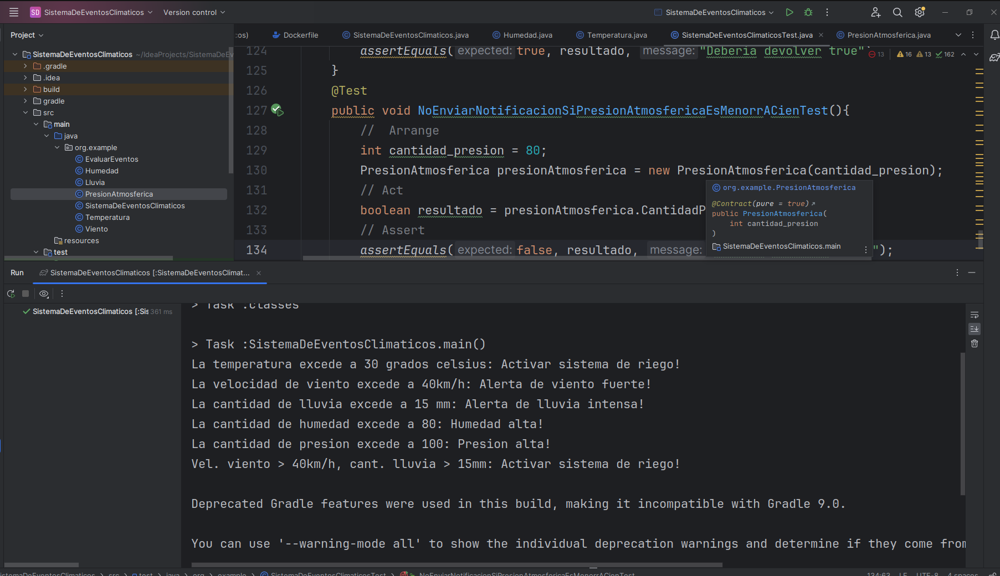
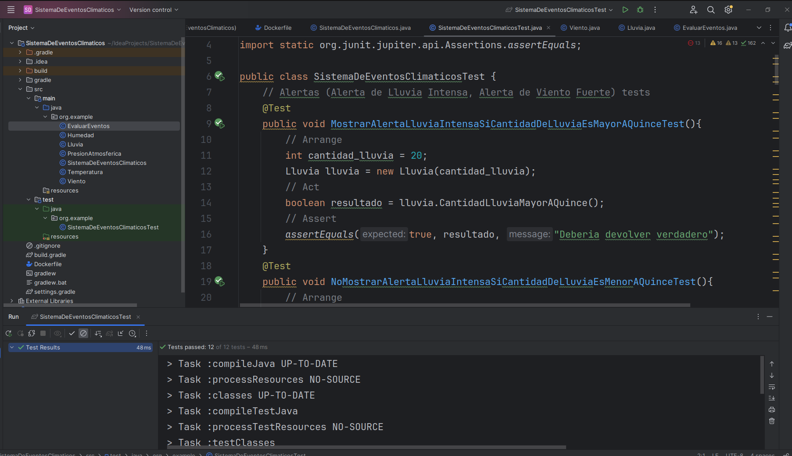

# EXAMEN FINAL
Refactorizacion de las clases
``` java
package org.example;

public class SistemaDeEventosClimaticos {
    public static void main(String[] args) {
        Temperatura temperatura = new Temperatura(32);
        Viento viento = new Viento(45);
        Lluvia lluvia = new Lluvia(18);
        Humedad humedad = new Humedad(87);
        PresionAtmosferica presionAtmosferica = new PresionAtmosferica(120);
        EvaluarEventos evaluarEventos = new EvaluarEventos(45,20);
        // REFACTORIZANDO EL FLUJO Y LOS METODOS DE LAS CLASES PARA QUE DEVUELVAN UN VALOR BOOLEANO
        /*
        // Comparaciones de una sola clase
        System.out.println(temperatura.CantidadCalorificaMayorATreinta());
        System.out.println(viento.VelocidadVientoMayorACuarenta());
        System.out.println(lluvia.CantidadLluviaMayorAQuince());
        System.out.println(humedad.CantidadHumedadMayorAOchenta());
        System.out.println(presionAtmosferica.CantidadPresionMayorACien());

        // Comparaciones entre dos clases (Viento y Lluvia)
        EvaluarEventos evaluarEventos = new EvaluarEventos(45,20);
        System.out.println(evaluarEventos.EventosSuperanSusUmbrales());
        */

        // Comparaciones de una sola clase
        if(temperatura.CantidadCalorificaMayorATreinta()){
            System.out.println("La temperatura excede a 30 grados celsius: Activar sistema de riego!");
        }else{
            System.out.println("La temperatura no excede a 30 grados celsius");
        }

        if(viento.VelocidadVientoMayorACuarenta()){
            System.out.println("La velocidad de viento excede a 40km/h: Alerta de viento fuerte!");
        }else{
            System.out.println("La velocidad de viento no excede a 40km/h");
        }

        if(lluvia.CantidadLluviaMayorAQuince()){
            System.out.println("La cantidad de lluvia excede a 15 mm: Alerta de lluvia intensa!");
        }else{
            System.out.println("La velocidad de viento no excede a 15 mm");
        }

        if(humedad.CantidadHumedadMayorAOchenta()){
            System.out.println("La cantidad de humedad excede a 80: Humedad alta!");
        }else{
            System.out.println("La cantidad de humedad no excede a 80");
        }

        if(presionAtmosferica.CantidadPresionMayorACien()){
            System.out.println("La cantidad de presion excede a 100: Presion alta!");
        }else{
            System.out.println("La cantidad de presion no excede a 100");
        }

        // Comparaciones entre dos clases (Viento y Lluvia)
        if(evaluarEventos.EventosSuperanSusUmbrales()){
            System.out.println("Vel. viento > 40km/h, cant. lluvia > 15mm: Activar sistema de riego!");
        }else{
            System.out.println("No se cumple: Vel. viento > 40km/h, cant. lluvia > 15mm");
        }
    }
}
```

``` java
package org.example;

public class Temperatura {
    int cantidad_calorifica;

    // REFACTORIZANDO, reemplazo el metodo SetCantidadCalorifica() por el constructor
    /*
    public void SetCantidadCalorifica(int cantidadCalorifica) {
        this.cantidad_calorifica = cantidadCalorifica;
    }
    */
    public Temperatura(int cantidad_calorifica) {
        this.cantidad_calorifica = cantidad_calorifica;
    }

    public boolean CantidadCalorificaMayorATreinta() {
        if(cantidad_calorifica > 30){
            return true;
        }else{
            return false;
        }
    }
}
```

Tambien modifique el tipo de dato que devuelven los metodos de las clases, antes devolvian String y ahora Boolean   
``` java
package org.example;

public class Humedad {
    int cantidad_humedad;

    public Humedad(int cantidad_humedad) {
        this.cantidad_humedad = cantidad_humedad;
    }

    public boolean CantidadHumedadMayorAOchenta() {
        if(cantidad_humedad > 80){
            return true;
        }else{
            return false;
        }
    }
}
```

``` java
package org.example;

public class Temperatura {
    int cantidad_calorifica;

    // REFACTORIZANDO, reemplazo el metodo SetCantidadCalorifica() por el constructor
    /*
    public void SetCantidadCalorifica(int cantidadCalorifica) {
        this.cantidad_calorifica = cantidadCalorifica;
    }
    */
    public Temperatura(int cantidad_calorifica) {
        this.cantidad_calorifica = cantidad_calorifica;
    }

    public boolean CantidadCalorificaMayorATreinta() {
        if(cantidad_calorifica > 30){
            return true;
        }else{
            return false;
        }
    }
}
```

``` java
package org.example;

public class PresionAtmosferica {
    int cantidad_presion;

    public PresionAtmosferica(int cantidad_presion) {
        this.cantidad_presion = cantidad_presion;
    }

    public boolean CantidadPresionMayorACien() {
        if(cantidad_presion > 100){
            return true;
        }else{
            return false;
        }
    }
}
```

``` java
package org.example;

public class Viento {
    int velocidad_viento;
    public Viento(int velocidad_viento) {
        this.velocidad_viento = velocidad_viento;
    }

    public boolean VelocidadVientoMayorACuarenta() {
        if(velocidad_viento > 40){
            return true;
        }else{
            return false;
        }
    }
}
```

``` java
package org.example;

public class Lluvia {
    int cantidad_lluvia;

    public Lluvia(int cantidad_lluvia) {
        this.cantidad_lluvia = cantidad_lluvia;
    }

    public boolean CantidadLluviaMayorAQuince() {
        if(cantidad_lluvia > 15){
            return true;
        }else{
            return false;
        }
    }
}
```

``` java
package org.example;

public class EvaluarEventos {
    Viento viento;
    Lluvia lluvia;
    public EvaluarEventos(int velocidad_viento, int cantidad_lluvia) {
        this.viento = new Viento(velocidad_viento);
        this.lluvia = new Lluvia(cantidad_lluvia);
    }

    public boolean EventosSuperanSusUmbrales() {
        if(viento.velocidad_viento > 40 && lluvia.cantidad_lluvia > 15){
            return true;
        }else{
            return false;
        }
    }
}
```

El cambio lo hice con el objetivo de que cada clase cumple con el princio de responsabilidad unica (cada clase se encarga de una tarea en especifico).

Ejecucion de la clase principal, SistemaDeEventosClimaticos  
  
Se observa en la imagen los resultados esperados, dadas ciertas condiciones climaticas.

Ahora la ejecucion de las pruebas (modifique el tipo de dato, ya no se espera un String sino un Boolean) 
  
En la imagen se observa que los 12 tests pasaron (color verde), esto quiere decir que se refactorizo el codigo sin romper las pruebas (sin que fallen). Esto es una buena practica (refactoring seguro) pues se modifica el codigo fuente para mejorar su estructura, legibilidad y mantenibilidad sin alterar su comportamiento (pruebas unitarias siguen funcionando correctamente)  

``` java
package org.example;

import org.junit.jupiter.api.Test;
import static org.junit.jupiter.api.Assertions.assertEquals;

public class SistemaDeEventosClimaticosTest {
    // Alertas (Alerta de Lluvia Intensa, Alerta de Viento Fuerte) tests
    @Test
    public void MostrarAlertaLluviaIntensaSiCantidadDeLluviaEsMayorAQuinceTest(){
        // Arrange
        int cantidad_lluvia = 20;
        Lluvia lluvia = new Lluvia(cantidad_lluvia);
        // Act
        boolean resultado = lluvia.CantidadLluviaMayorAQuince();
        // Assert
        assertEquals(true, resultado, "Deberia devolver verdadero");
    }
    @Test
    public void NoMostrarAlertaLluviaIntensaSiCantidadDeLluviaEsMenorAQuinceTest(){
        // Arrange
        int cantidad_lluvia = 10;
        Lluvia lluvia = new Lluvia(cantidad_lluvia);
        // Act
        boolean resultado = lluvia.CantidadLluviaMayorAQuince();
        // Assert
        assertEquals(false, resultado, "Deberia devolver falso");
    }
    @Test
    public void MostrarAlertaVientoFuerteSiVelocidadDelVientoEsMayorACuarentaTest(){
        // Arrange
        int velocidad_viento = 45;
        Viento viento = new Viento(velocidad_viento);
        // Act
        boolean resultado = viento.VelocidadVientoMayorACuarenta();
        // Assert
        assertEquals(true, resultado, "Deberia devolver true");
    }
    @Test
    public void NoMostrarAlertaVientoFuerteSiVelocidadDelVientoEsMenorACuarentaTest(){
        // Arrange
        int velocidad_viento = 30;
        Viento viento = new Viento(velocidad_viento);
        // Act
        boolean resultado = viento.VelocidadVientoMayorACuarenta();
        // Assert
        assertEquals(false, resultado, "Deberia devolver false");
    }
    // Acciones automáticas (Activar Sistema de Riego, Cerrar Persianas) tests
    @Test
    public void ActivarSistemaDeRiegoSiTemperaturaEsMayorATreintaTest(){
        // Arrange
        int cantidad_calorifica = 32;
        Temperatura temperatura = new Temperatura(cantidad_calorifica);
        // Act
        boolean resultado = temperatura.CantidadCalorificaMayorATreinta();
        // Assert
        assertEquals(true, resultado, "Deberia devolver true");
    }
    @Test
    public void NoActivarSistemaDeRiegoSiTemperaturaEsMenorATreintaTest(){
        // Arrange
        int cantidad_calorifica = 25;
        Temperatura temperatura = new Temperatura(cantidad_calorifica);
        // Act
        boolean resultado = temperatura.CantidadCalorificaMayorATreinta();
        // Assert
        assertEquals(false, resultado, "Deberia devolver false");
    }
    @Test
    public void CerrarPersianasSiVelocidadDelVientoEsMayorACuarentaYCantidadDeLluviaEsMayorAQuinceTest(){
        // Arrange
        int velocidad_viento = 42;
        Viento viento = new Viento(velocidad_viento);
        int cantidad_lluvia = 17;
        Lluvia lluvia = new Lluvia(cantidad_lluvia);
        EvaluarEventos evaluarEventos = new EvaluarEventos(velocidad_viento, cantidad_lluvia);
        // Act
        boolean resultado = evaluarEventos.EventosSuperanSusUmbrales();
        // Assert
        assertEquals(true, resultado, "Deberia devolver true");
    }
    @Test
    public void NoCerrarPersianasSiVelocidadDelVientoEsMenorACuarentaYCantidadDeLluviaEsMenorAQuinceTest(){
        // Arrange
        int velocidad_viento = 28;
        Viento viento = new Viento(velocidad_viento);
        int cantidad_lluvia = 10;
        Lluvia lluvia = new Lluvia(cantidad_lluvia);
        EvaluarEventos evaluarEventos = new EvaluarEventos(velocidad_viento, cantidad_lluvia);
        // Act
        boolean resultado = evaluarEventos.EventosSuperanSusUmbrales();
        // Assert
        assertEquals(false, resultado, "Deberia devolver false");
    }
    // Notificaciones (Enviar Notificación a Usuarios) tests
    @Test
    public void EnviarNotificacionSiHumedadEsMayorAOchentaTest(){
        // Arrange
        int cantidad_humedad = 87;
        Humedad humedad = new Humedad(cantidad_humedad);
        // Act
        boolean resultado = humedad.CantidadHumedadMayorAOchenta();
        // Assert
        assertEquals(true, resultado, "Deberia devolver true");
    }
    @Test
    public void NoEnviarNotificacionSiHumedadEsMenorAOchentaTest(){
        // Arrange
        int cantidad_humedad = 75;
        Humedad humedad = new Humedad(cantidad_humedad);
        // Act
        boolean resultado = humedad.CantidadHumedadMayorAOchenta();
        // Assert
        assertEquals(false, resultado, "Deberia devolver false");
    }
    @Test
    public void EnviarNotificacionSiPresionAtmosfericaEsMayorACienTest(){
        //  Arrange
        int cantidad_presion = 120;
        PresionAtmosferica presionAtmosferica = new PresionAtmosferica(cantidad_presion);
        // Act
        boolean resultado = presionAtmosferica.CantidadPresionMayorACien();
        // Assert
        assertEquals(true, resultado, "Deberia devolver true");
    }
    @Test
    public void NoEnviarNotificacionSiPresionAtmosfericaEsMenorrACienTest(){
        //  Arrange
        int cantidad_presion = 80;
        PresionAtmosferica presionAtmosferica = new PresionAtmosferica(cantidad_presion);
        // Act
        boolean resultado = presionAtmosferica.CantidadPresionMayorACien();
        // Assert
        assertEquals(false, resultado, "Deberia devolver false");
    }
}
```
