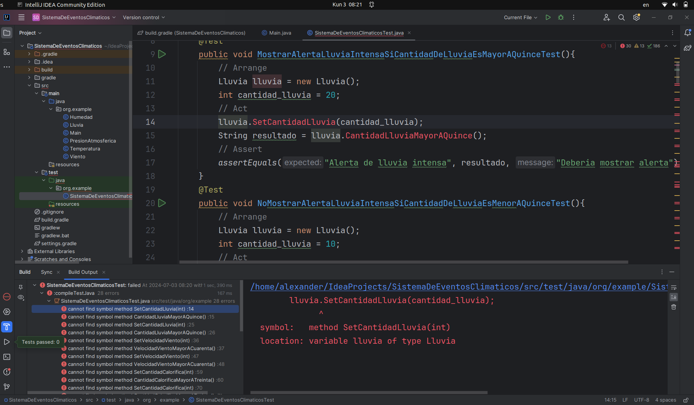
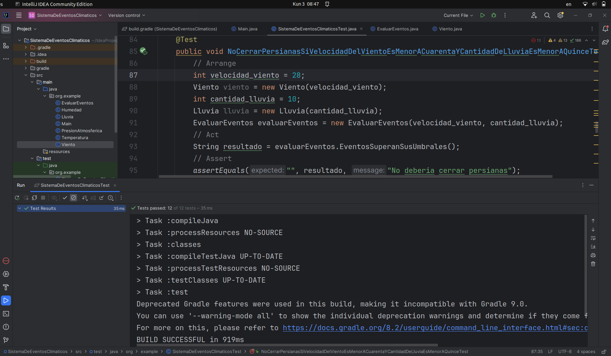
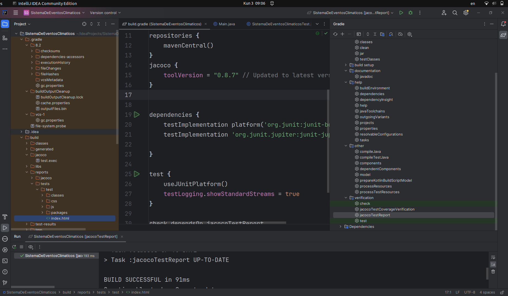
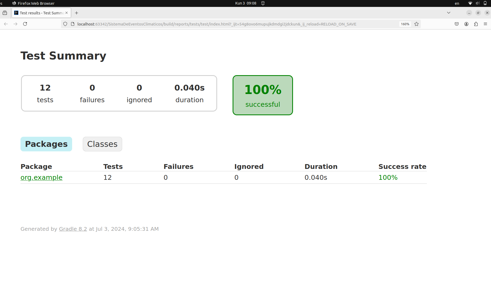
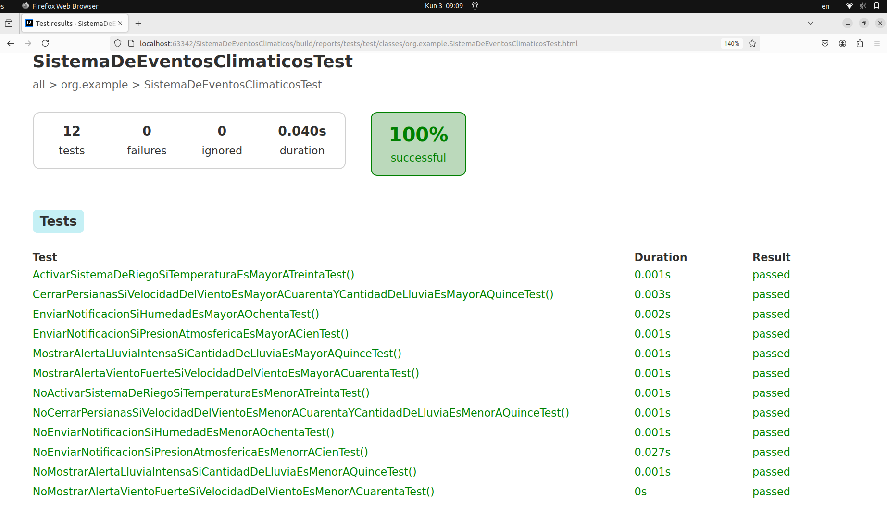

# EXAMEN FINAL
## Sprint 1
Objetivos  
- **Desarrollo inicial del sistema:** Crear el sistema con un diseño limpio y clases con
responsabilidad única.  
- **Implementación de TDD:** Utilizar el desarrollo dirigido por pruebas (TDD) para asegurar que
cada componente cumpla con su responsabilidad.  
- **Estrategia de validación de pruebas:** Definir y aplicar una estrategia de validación que
incluya stubs y fakes para simular las condiciones climáticas externas.  
- **Refactorización y código limpio:** Asegurar que el código sea limpio y fácil de mantener
mediante la refactorización continua.  
- **Métricas de calidad:** Establecer métricas de calidad para evaluar la cobertura de pruebas y la complejidad del código.

Para seguir el principio TDD, primero se creo las clases ```Lluvia```, ```Viento```, ```Humedad```, ```PresionAtmosferica```, ```Temperatura``` y ```EvaluarEventos``` sin implementarlas. 
Luego se procede a escribir las pruebas unitarias: 
``` java
package org.example;

import org.junit.jupiter.api.Test;
import static org.junit.jupiter.api.Assertions.assertEquals;

public class SistemaDeEventosClimaticosTest {
    // Alertas (Alerta de Lluvia Intensa, Alerta de Viento Fuerte) tests
    @Test
    public void MostrarAlertaLluviaIntensaSiCantidadDeLluviaEsMayorAQuinceTest(){
        // Arrange
        int cantidad_lluvia = 20;
        Lluvia lluvia = new Lluvia(cantidad_lluvia);
        // Act
        String resultado = lluvia.CantidadLluviaMayorAQuince();
        // Assert
        assertEquals("Alerta de lluvia intensa", resultado, "Deberia mostrar alerta");
    }
    @Test
    public void NoMostrarAlertaLluviaIntensaSiCantidadDeLluviaEsMenorAQuinceTest(){
        // Arrange
        int cantidad_lluvia = 10;
        Lluvia lluvia = new Lluvia(cantidad_lluvia);
        // Act
        String resultado = lluvia.CantidadLluviaMayorAQuince();
        // Assert
        assertEquals("", resultado, "No Deberia mostrar alerta");
    }
    @Test
    public void MostrarAlertaVientoFuerteSiVelocidadDelVientoEsMayorACuarentaTest(){
        // Arrange
        int velocidad_viento = 45;
        Viento viento = new Viento(velocidad_viento);
        // Act
        String resultado = viento.VelocidadVientoMayorACuarenta();
        // Assert
        assertEquals("Alerta de viento fuerte", resultado, "Deberia mostrar alerta");
    }
    @Test
    public void NoMostrarAlertaVientoFuerteSiVelocidadDelVientoEsMenorACuarentaTest(){
        // Arrange
        int velocidad_viento = 30;
        Viento viento = new Viento(velocidad_viento);
        // Act
        String resultado = viento.VelocidadVientoMayorACuarenta();
        // Assert
        assertEquals("", resultado, "No deberia mostrar alerta");
    }
    // Acciones automáticas (Activar Sistema de Riego, Cerrar Persianas) tests
    @Test
    public void ActivarSistemaDeRiegoSiTemperaturaEsMayorATreintaTest(){
        // Arrange
        Temperatura temperatura = new Temperatura();
        int cantidad_calorifica = 32;
        // Act
        temperatura.SetCantidadCalorifica(cantidad_calorifica);
        String resultado = temperatura.CantidadCalorificaMayorATreinta();
        // Assert
        assertEquals("Activar sistema de riego", resultado, "Deberia activar sistema");
    }
    @Test
    public void NoActivarSistemaDeRiegoSiTemperaturaEsMenorATreintaTest(){
        // Arrange
        Temperatura temperatura = new Temperatura();
        int cantidad_calorifica = 25;
        // Act
        temperatura.SetCantidadCalorifica(cantidad_calorifica);
        String resultado = temperatura.CantidadCalorificaMayorATreinta();
        // Assert
        assertEquals("", resultado, "No deberia activar sistema");
    }
    @Test
    public void CerrarPersianasSiVelocidadDelVientoEsMayorACuarentaYCantidadDeLluviaEsMayorAQuinceTest(){
        // Arrange
        int velocidad_viento = 42;
        Viento viento = new Viento(velocidad_viento);
        int cantidad_lluvia = 17;
        Lluvia lluvia = new Lluvia(cantidad_lluvia);
        EvaluarEventos evaluarEventos = new EvaluarEventos(velocidad_viento, cantidad_lluvia);
        // Act
        String resultado = evaluarEventos.EventosSuperanSusUmbrales();
        // Assert
        assertEquals("Cerrar persianas", resultado, "Deberia cerrar persianas");
    }
    @Test
    public void NoCerrarPersianasSiVelocidadDelVientoEsMenorACuarentaYCantidadDeLluviaEsMenorAQuinceTest(){
        // Arrange
        int velocidad_viento = 28;
        Viento viento = new Viento(velocidad_viento);
        int cantidad_lluvia = 10;
        Lluvia lluvia = new Lluvia(cantidad_lluvia);
        EvaluarEventos evaluarEventos = new EvaluarEventos(velocidad_viento, cantidad_lluvia);
        // Act
        String resultado = evaluarEventos.EventosSuperanSusUmbrales();
        // Assert
        assertEquals("", resultado, "No deberia cerrar persianas");
    }
    // Notificaciones (Enviar Notificación a Usuarios) tests
    @Test
    public void EnviarNotificacionSiHumedadEsMayorAOchentaTest(){
        // Arrange
        int cantidad_humedad = 87;
        Humedad humedad = new Humedad(cantidad_humedad);
        // Act
        String resultado = humedad.CantidadHumedadMayorAOchenta();
        // Assert
        assertEquals("Humedad alta", resultado, "Deberia enviar notificacion");
    }
    @Test
    public void NoEnviarNotificacionSiHumedadEsMenorAOchentaTest(){
        // Arrange
        int cantidad_humedad = 75;
        Humedad humedad = new Humedad(cantidad_humedad);
        // Act
        String resultado = humedad.CantidadHumedadMayorAOchenta();
        // Assert
        assertEquals("", resultado, "No deberia enviar notificacion");
    }
    @Test
    public void EnviarNotificacionSiPresionAtmosfericaEsMayorACienTest(){
        //  Arrange
        int cantidad_presion = 120;
        PresionAtmosferica presionAtmosferica = new PresionAtmosferica(cantidad_presion);
        // Act
        String resultado = presionAtmosferica.CantidadPresionMayorACien();
        // Assert
        assertEquals("Presion atmosferica alta", resultado, "Deberia enviar notificacion");
    }
    @Test
    public void NoEnviarNotificacionSiPresionAtmosfericaEsMenorrACienTest(){
        //  Arrange
        int cantidad_presion = 80;
        PresionAtmosferica presionAtmosferica = new PresionAtmosferica(cantidad_presion);
        // Act
        String resultado = presionAtmosferica.CantidadPresionMayorACien();
        // Assert
        assertEquals("", resultado, "No deberia enviar notificacion");
    }
}
```

Al ejecutar todas las pruebas fallan (color rojo) como se muestra en la imagen  
  

Ahora escribo codigo suficiente para que todas las pruebas pasen (color verde)  

``` java
package org.example;

public class Lluvia {
    int cantidad_lluvia;

    public Lluvia(int cantidad_lluvia) {
        this.cantidad_lluvia = cantidad_lluvia;
    }

    public String CantidadLluviaMayorAQuince() {
        if(cantidad_lluvia > 15){
            return "Alerta de lluvia intensa";
        }else{
            return "";
        }
    }
}
```


``` java
package org.example;

public class Humedad {
    int cantidad_humedad;

    public Humedad(int cantidad_humedad) {
        this.cantidad_humedad = cantidad_humedad;
    }

    public String CantidadHumedadMayorAOchenta() {
        if(cantidad_humedad > 80){
            return "Humedad alta";
        }else{
            return "";
        }
    }
}
```


``` java
package org.example;

public class Temperatura {
    int cantidad_calorifica;
    public void SetCantidadCalorifica(int cantidadCalorifica) {
        this.cantidad_calorifica = cantidadCalorifica;
    }

    public String CantidadCalorificaMayorATreinta() {
        if(cantidad_calorifica > 30){
            return "Activar sistema de riego";
        }else{
            return "";
        }
    }
}
```


``` java
package org.example;

public class PresionAtmosferica {
    int cantidad_presion;

    public PresionAtmosferica(int cantidad_presion) {
        this.cantidad_presion = cantidad_presion;
    }

    public String CantidadPresionMayorACien() {
        if(cantidad_presion > 100){
            return "Presion atmosferica alta";
        }else{
            return "";
        }
    }
}
```


``` java
package org.example;

public class Viento {
    int velocidad_viento;
    public Viento(int velocidad_viento) {
        this.velocidad_viento = velocidad_viento;
    }

    public String VelocidadVientoMayorACuarenta() {
        if(velocidad_viento > 40){
            return "Alerta de viento fuerte";
        }else{
            return "";
        }
    }
}

```


``` java
package org.example;

public class EvaluarEventos {
    Viento viento;
    Lluvia lluvia;
    public EvaluarEventos(int velocidad_viento, int cantidad_lluvia) {
        this.viento = new Viento(velocidad_viento);
        this.lluvia = new Lluvia(cantidad_lluvia);
    }

    public String EventosSuperanSusUmbrales() {
        if(viento.velocidad_viento > 40 && lluvia.cantidad_lluvia > 15){
            return "Cerrar persianas";
        }else{
            return "";
        }
    }
}
```

Con estas implementaciones las pruebas pasan como se muestra en la imagen  
  

Para la prueba de cobertura con JaCoCo primero configuro el archivo build.gradle de la siguiente manera  

``` java
plugins {
    id 'java'
}

apply plugin: 'java-library'
apply plugin: "jacoco"

group = 'org.example'
version = '1.0-SNAPSHOT'

repositories {
    mavenCentral()
}
jacoco {
    toolVersion = "0.8.7" // Updated to latest version
}


dependencies {
    testImplementation platform('org.junit:junit-bom:5.9.1')
    testImplementation 'org.junit.jupiter:junit-jupiter'

}

test {
    useJUnitPlatform()
    testLogging.showStandardStreams = true
}

check.dependsOn jacocoTestReport
```

Ahora generamos un reporte de cobertura como se muestra en la imagen  
  

Al abrir el archivo ```index.html``` (generado por JaCoCo) en un navegador obtengo el siguiente reporte  
   

Para ver mas detalles de la cobertura doy doble click en ```org.example```  
   
La imagen muestra que las pruebas fueron cubiertas en un 100 por ciento  

## Sprint 2
