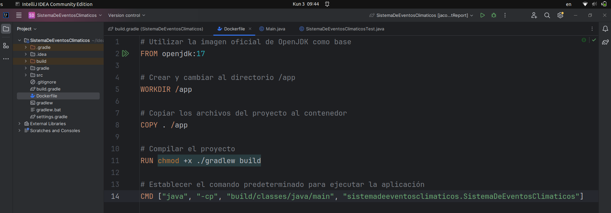
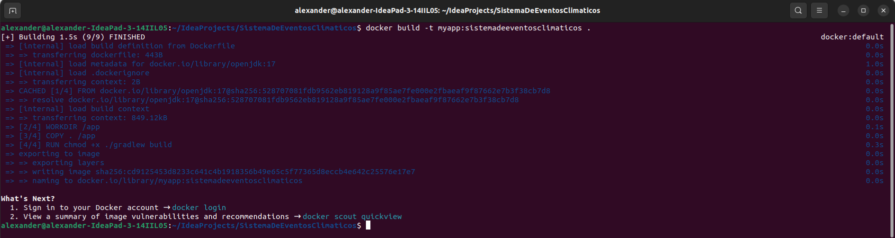
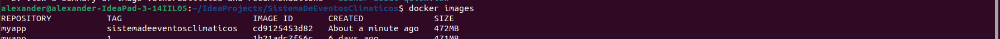

## Sprint 2
Objetivos  
- **Contenerización del sistema:** Utilizar Docker para contenerizar la aplicación y asegurar su
portabilidad.  
- **Refinamiento del tDD:** Continuar utilizando TDD para cualquier nueva funcionalidad o
mejora.  
- **Mejora de la estrategia de pruebas:** Integrar la estrategia de pruebas en un entorno
Dockerizado.  
- **Refactorización y código limpio:** Continuar refactorizando el código para mantener su
calidad.  
- **Métricas de calidad:** Continuar monitoreando y mejorando las métricas de calidad del
código.

Actividades  
**1. Contenerización del Sistema:**  
o Crear un Dockerfile para construir la imagen de la aplicación.  
o Configurar un docker-compose.yml si se necesitan múltiples servicios (bases de
datos, servicios de simulación de clima).  
**2. Refinamiento del TDD:**  
o Escribir nuevas pruebas para cualquier funcionalidad adicional.  
o Asegurar que todas las pruebas existentes pasen en el entorno Dockerizado.  
**3. Mejora de la estrategia de pruebas:**  
o Integrar las pruebas unitarias y de integración en el pipeline de Docker.  
o Asegurar que los stubs y fakes funcionen correctamente en el entorno contenerizado.  
**4. Refactorización y código limpio:**  
o Continuar refactorizando el código para mejorar la calidad y mantener la adherencia
a los principios de diseño limpio.  
**5. Métricas de Calidad:**  
o Monitorear la cobertura de pruebas y la complejidad del código en el entorno Dockerizado.  
o Utilizar herramientas de análisis de código para asegurar la calidad.  

Escribo el Dockerfile y lo ubico en el mismo nivel donde se encuentra el archivo build.gradle  
``` java
# Utilizar la imagen oficial de OpenJDK como base
FROM openjdk:17

# Crear y cambiar al directorio /app
WORKDIR /app

# Copiar los archivos del proyecto al contenedor
COPY . /app

# Compilar el proyecto
RUN chmod +x ./gradlew build

# Establecer el comando predeterminado para ejecutar la aplicación
CMD ["java", "-cp", "build/classes/java/main", "sistemadeeventosclimaticos.SistemaDeEventosClimaticos"]
```

  

Una vez creado el Dockerfile crearemos una imagen en base de dicho Dockerfile ejecutando el siguiente comando:  
```docker build -t myapp:sistemadeeventosclimaticos .```  
Nota1: cambiar de directorio y ubicarse en el directorio donde se encuentra su aplicacion.  
Nota2: es importante el (.) al final pues ello indica que se creara la imagen en base al Dockerfile que se ubica en la ruta actual.  

  
Ahora para verificar la creacion de dicha imagen ejecutamos el siguiente comando  
```docker images```  

  
Aqui se muestra el nombre del repositorio que le asigne, el tag, el id de la imagen, hace cuanto fue creado y el size  


