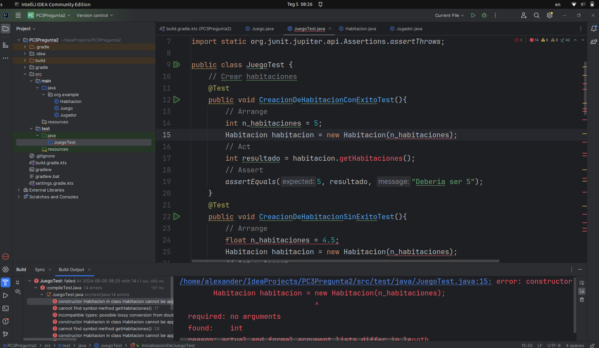
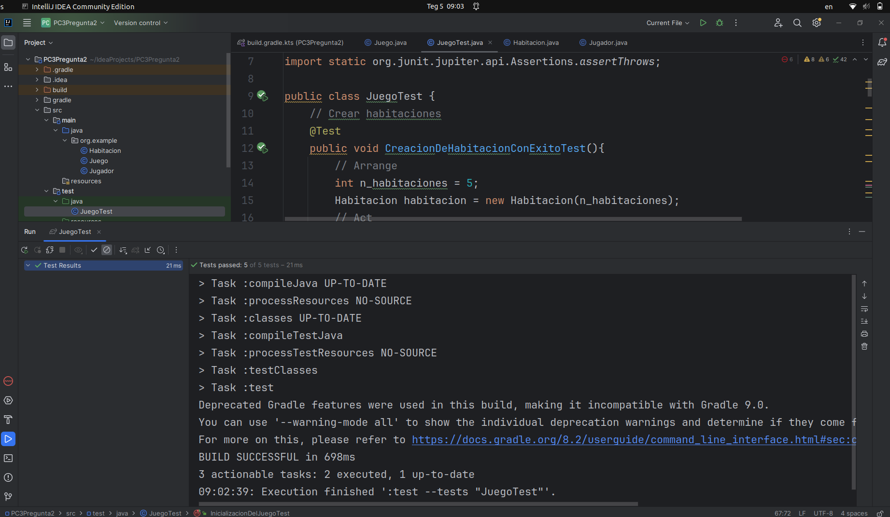
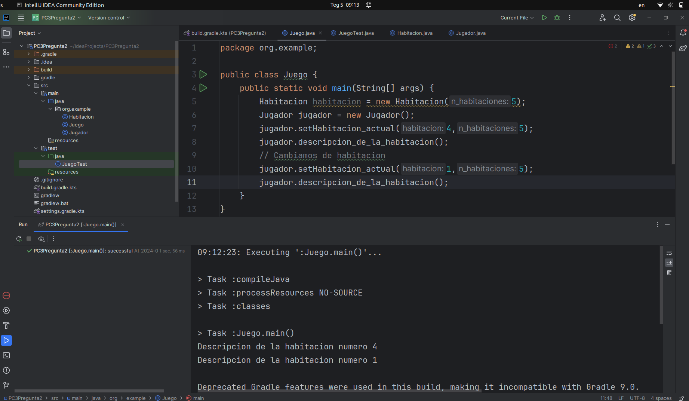

# Pregunta 2
## Sprint 1
Primero se crea las pruebas para seguir con el principio de TDD  
Las pruebas son las siguientes:  
``` java
import org.example.Habitacion;
import org.example.Juego;
import org.example.Jugador;
import org.junit.jupiter.api.Test;

import static org.junit.jupiter.api.Assertions.assertEquals;
import static org.junit.jupiter.api.Assertions.assertThrows;

public class JuegoTest {
    // Crear habitaciones
    @Test
    public void CreacionDeHabitacionConExitoTest(){
        // Arrange
        int n_habitaciones = 5;
        Habitacion habitacion = new Habitacion(n_habitaciones);
        // Act
        int resultado = habitacion.getN_habitaciones();
        // Assert
        assertEquals(5, resultado, "Deberia ser 5");
    }
    @Test
    public void CreacionDeHabitacionSinExitoTest(){
        // Arrange
        int n_habitaciones = 0;
        Habitacion habitacion = new Habitacion(n_habitaciones);
        // Act y Assert
        assertThrows(ArithmeticException.class, ()->{
            habitacion.getN_habitaciones();
        });
    }
    // Movimiento del jugador
    @Test
    public void MovimientoDelJugadorValidoTest(){
        // Arrange
        int n_habitaciones = 5;
        Habitacion habitacion = new Habitacion(n_habitaciones);
        Jugador jugador = new Jugador();
        int mover_a_la_habitacion = 2;
        // Act
        jugador.setHabitacion_actual(mover_a_la_habitacion, n_habitaciones);
        int resultado = jugador.getHabitacion_actual();
        // Assert
        assertEquals(2, resultado, "Deberia estar en la habitacion 2");
    }
    @Test
    public void MovimientoDelJugadorInvalidoTest(){
        // Arrange
        int n_habitaciones = 5;
        Habitacion habitacion = new Habitacion(n_habitaciones);
        Jugador jugador = new Jugador();
        int mover_a_la_habitacion = 6;
        // Act y Assert
        assertThrows(ArithmeticException.class, ()->{
            jugador.setHabitacion_actual(mover_a_la_habitacion, n_habitaciones);
        });
    }
    // Inicializacion del juego
    @Test
    public void InicializacionDelJuegoTest(){
        // Arrange
        int n_habitaciones = 5;
        Habitacion habitacion = new Habitacion(n_habitaciones);
        Jugador jugador = new Jugador();
        int habitacion_inicial = 3;
        Juego juego = new Juego();
        // Act
        jugador.setHabitacion_actual(habitacion_inicial, n_habitaciones);
        int resultado = jugador.getHabitacion_actual();
        // Assert
        assertEquals(3, resultado, "Deberia iniciar el juego con el jugador en la habitacion 3");
    }
}
```   
  
En la imagen se observa que los tests no pasan (estan en color rojo los 5 tests)  

Ahora escribo codigo suficiente para que pasen todos los tests  
``` java
package org.example;

public class Juego {
    public static void main(String[] args) {
        Habitacion habitacion = new Habitacion(5);
        Jugador jugador = new Jugador();
        jugador.setHabitacion_actual(4,5);
        jugador.descripcion_de_la_habitacion();
        // Cambiamos de habitacion
        jugador.setHabitacion_actual(1,5);
        jugador.descripcion_de_la_habitacion();
    }
}
```
``` java
package org.example;

public class Habitacion {
    int n_habitaciones;
    public Habitacion(int n_habitaciones){
        this.n_habitaciones = n_habitaciones;
    }
    public int getN_habitaciones(){
        if (n_habitaciones == 0){
            throw new ArithmeticException("Ninguna habitacion");
        }
        return n_habitaciones;
    }
}

```
``` java
package org.example;

public class Jugador {
    int habitacion_actual;
    public int getHabitacion_actual() {
        return habitacion_actual;
    }
    public void setHabitacion_actual(int habitacion, int n_habitaciones){
        if (habitacion > n_habitaciones){
            throw new ArithmeticException("Excede la cantidad de habitaciones");
        }
        this.habitacion_actual = habitacion;
    }
    public void descripcion_de_la_habitacion(){
        System.out.println("Descripcion de la habitacion numero " + habitacion_actual);
    }
}
```
  
En la imagen se observa que los 5 tests pasaron (estan de color verde)  
Luego ejecuto la clase principal Juego  
  
En la imagen se oberva que la salida son descripciones de la habitacion actual donde se encuentra el jugador, primero inicia en la habitacion numero 4 y luego se cambia a la habitacion numero 1
