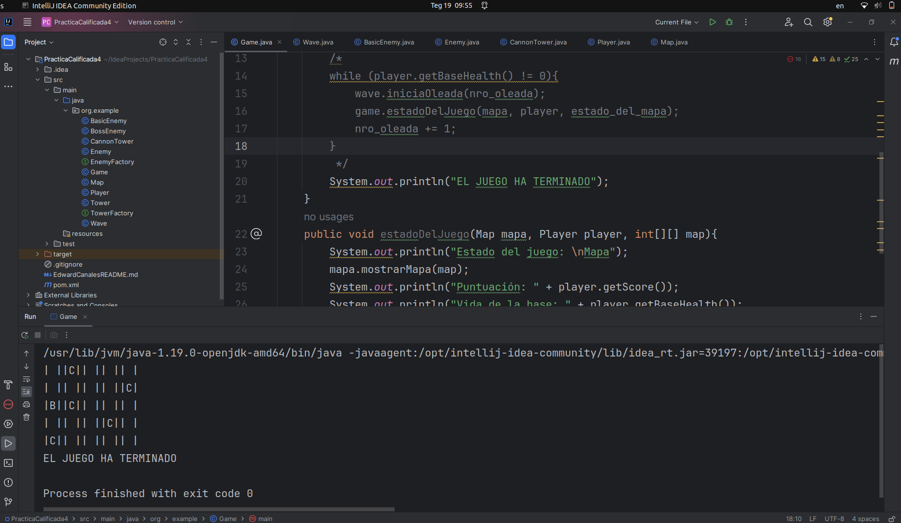

# Practica Calificada 4
Creo las clases principales:  
Game: Clase principal que maneja la lógica del juego.  
Map: Representa el mapa del juego.  
Enemy: Clase base para todos los enemigos.  
Tower: Clase base para todas las torres.  
Wave: Maneja las oleadas de enemigos.  
Player: Representa al jugador y sus estadísticas.  
Y las interfaces:  
EnemyFactory: Interfaz para la creación de enemigos (concretas: BasicEnemyFactory, BossEnemyFactory).  
TowerFactory: Interfaz para la creación de torres (concretas: CannonTowerFactory, LaserTowerFactory).  

La siguiente imagen muestra una primera ejecucion de la inicializacion del mapa con las posiciones de los caminos para los enemigos (C), posicion de la Base (B) y las posiciones vacias (| |)  
  
Aun me falta mejorar el flujo del juego  

