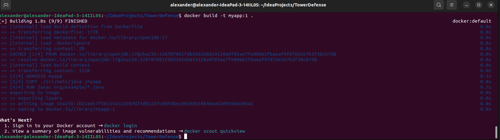

# Practica calificada 5
## Ejercicio 1: Configuración y uso de docker
### Teoría:
* Describe los principios fundamentales de los contenedores Docker y su arquitectura interna. Explica cómo Docker maneja la seguridad y el aislamiento de contenedores.
RESPUESTA:
Los principios fundamentales de docker son: empaquetado de aplicaciones, Docker facilita empaquetar una aplicacion junto con sus requerimientos para que esta aplicacion pueda ser ejecutado en cualquier otro computador; portabilidad, dado que empaqueta aplicaciones con sus requerimientos es facil su portabilidad en otras maquinas o un servidor en la nube; aislamiento, los contenedores de Docker son ejecutados en espacios aislados. La arquitectura de Docker se compone de Docker Engine (es su motor central), imagenes Docker y contenedores Docker.
### Práctico:
  
La posicion del Dockerfile es al mismo nivel build.gradle, _FROM openjdk:17_ es la imagen base obtenida de Docker Hub [Docker Hub - imagen openjdk](https://hub.docker.com/_/openjdk), _WORKDIR myapp_ es para establecer el directorio de trabajo del contenedor, _COPY ./src/main/java /myapp_ copia el codigo fuente, _RUN javac org/example/*.java_ compila todos los archivos del codigo fuente, _EXPOSE 8080_ expone el puerto para podernos conectar a este contenedor, _CMD ["java", "org.example.Main"]_ es el comando que tiene que ejecutarse para que nuestra aplicacion corra.  

  
``` docker build -t myapp:1 .``` este comando sirve para crear una imagen en base de un archivo Dockerfile. myapp es el nombre que uno mismo asigna, 1 es el tag (tambien uno mismo lo asigna)

