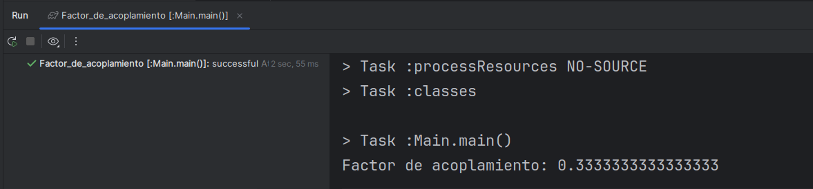

# Actividad: Refactorizacion
## Ejercicio 1: Refactorización para mejorar la cohesión y reducir el acoplamiento
Codigo inicial
``` java
public class EmployeeManager {
	public void addEmployee(String name, String department) {
		// Añade un empleado al departamento
		System.out.println("Empleado añadido");
	}
	public void removeEmployee(String name) {
		// Elimina un empleado
		System.out.println("Empleado eliminado");
	}
	public void changeDepartment(String employeeName, String newDepartment) {
		// Cambia un empleado de departamento
		System.out.println("Departamento cambiado");
	}
	public void printDepartmentReport(String department) {
		// Imprime un informe del departamento
		System.out.println("Informe del departamento " + department);
	}
	public void printAllDepartments() {
		// Imprime todos los departamentos
		System.out.println("Lista de todos los departamentos");
	}
}
```
Codigo refactorizado
``` java
package org.example;

import java.util.ArrayList;
import java.util.List;
// Alto acoplamiento = modulos (metodos) dependen unos de otros
// Bajo cohesion = los elementos de un modulo no permanecen juntos

public class EmployeeManager {
    // ATRIBUTOS DE INSTANCIA
    private List<Employee> employees = new ArrayList<>();
    private List<Department> departments = new ArrayList<>();
    /*
    public void addEmployee(String name, String department) {
        // Añade un empleado al departamento
        System.out.println("Empleado añadido");
    }
    */
    // Se refactoriza addEmployee para agregar empleados a la lista de empleados employees
    public void addEmployee(String name, String departmentName) {
        Department department = findDepartment(departmentName);
        if (department == null) {
            department = new Department(departmentName);
            departments.add(department);
        }
        Employee employee = new Employee(name, departmentName);
        employees.add(employee);
        System.out.println("Empleado añadido");
    }
    /*
    public void removeEmployee(String name) {
        // Elimina un empleado
        System.out.println("Empleado eliminado");
    }
    */
    // Se refactoriza removeEmployee para eliminar empleados de la lista de empleados employees
    public void removeEmployee(String name) {
        employees.removeIf(employee -> employee.getName().equals(name));
        System.out.println("Empleado eliminado");
    }
    /*
    public void changeDepartment(String employeeName, String newDepartment) {
        // Cambia un empleado de departamento
        System.out.println("Departamento cambiado");
    }
    */
    // Se refactoriza changeDepartment para cambiar el departamento al que pertence un empleado
    public void changeDepartment(String employeeName, String newDepartmentName) {
        for (Employee employee : employees) {
            if (employee.getName().equals(employeeName)) {
                employee.setDepartment(newDepartmentName);
                System.out.println("Departamento cambiado");
                return;
            }
        }
    }
    /*
    public void printDepartmentReport(String department) {
        // Imprime un informe del departamento
        System.out.println("Informe del departamento " + department);
    }
    */
    // Se refactoriza printDepartment para imprimir un informe de departamento con sus respectivos empleados
    public void printDepartmentReport(String departmentName) {
        System.out.println("Informe del departamento " + departmentName);
        for (Employee employee : employees) {
            if (employee.getDepartment().equals(departmentName)) {
                System.out.println(employee.getName());
            }
        }
    }
    /*
    public void printAllDepartments() {
        // Imprime todos los departamentos
        System.out.println("Lista de todos los departamentos");
    }
    */
    // Se refactoriza printAllDepartment para imprimir todos los departamentos de departments
    public void printAllDepartments() {
        System.out.println("Lista de todos los departamentos");
        for (Department department : departments) {
            System.out.println(department.getName());
        }
    }
    // Se crea el metodo findDepartment para buscar si existe un departamento con nombre name
    private Department findDepartment(String name) {
        for (Department department : departments) {
            if (department.getName().equals(name)) {
                return department;
            }
        }
        return null;
    }
}
```

``` java
package org.example;

public class Employee {
    private String name;
    private String department;

    // Constructor, getters y setters
    public Employee(String name, String department) {
        this.name = name;
        this.department = department;
    }

    public String getName() {
        return name;
    }

    public String getDepartment() {
        return department;
    }

    public void setDepartment(String department) {
        this.department = department;
    }
}
```

``` java
package org.example;

public class Department {
    private String name;

    // Constructor, getters y setters
    public Department(String name) {
        this.name = name;
    }

    public String getName() {
        return name;
    }
}
```

Para calcular el factor de acoplamiento se implementa el siguiente codigo
``` java
package org.example;

public class Main {
    public static void main(String[] args) {
        /*
        EmployeeManager
        Employee
        Department
        */
        Module employeeManager = new Module("EmployeeManager");
        Module employee = new Module("Employee");
        Module department = new Module("Department");

        employeeManager.addDependency(employee);
        employeeManager.addDependency(department);

        Module[] modules = {employeeManager,employee,department};

        int totalDependencies = 0;
        for (Module module : modules) {
            totalDependencies += module.getDependencies().size();
        }

        int totalModules = modules.length;

        double factor_acoplamiento = (double) totalDependencies / (totalModules * (totalModules - 1));
        System.out.println("Factor de acoplamiento: " + factor_acoplamiento);
    }
}
```

``` java
package org.example;

import java.util.HashSet;
import java.util.Set;

public class Module {
    private String name;
    private Set<Module> dependencies;

    public Module(String name) {
        this.name = name;
        this.dependencies = new HashSet<>();
    }

    public String getName() {
        return name;
    }

    public void addDependency(Module module) {
        dependencies.add(module);
    }

    public Set<Module> getDependencies() {
        return dependencies;
    }
}
```

Al ejecutar se obtiene un factor de acoplamiento igual a 0.3333333333333333  
  
Como el factor de acoplamiento varia entre 0 y 1, entonces 0.3333333333333333 es un bajo acoplamiento por lo tanto tiene mayor modularidad y mantenibilidad  

Para calcular el LCOM se implementa el siguiente codigo  
``` java
package org.example;

import java.util.Arrays;
import java.util.HashSet;
import java.util.List;
import java.util.Set;

public class Main {
    public static void main(String[] args) {
        ClassInfo classInfo = new ClassInfo();
        /*
        METODOS DE LA CLASE EmployeeManager
        addEmployee
        removeEmployee
        changeDepartment
        printDepartmentReport
        printAllDepartments
        findDepartment
        ATRIBUTOS DE INSTANCIA DE LA CLASE EmployeeManager
        employees
        departments
        */
        // Simulación de entrada de métodos y sus accesos a atributos
        classInfo.addMethod("addEmployee", new HashSet<>(Arrays.asList("employees", "departments")));
        classInfo.addMethod("removeEmployee", new HashSet<>(Arrays.asList("employees")));
        classInfo.addMethod("changeDepartment", new HashSet<>(Arrays.asList("employees")));
        classInfo.addMethod("printDepartmentReport", new HashSet<>(Arrays.asList("employees")));
        classInfo.addMethod("printAllDepartments", new HashSet<>(Arrays.asList("departments")));
        classInfo.addMethod("findDepartment", new HashSet<>(Arrays.asList("departments")));
        int p = 0, q = 0;
        List<String> methods = classInfo.methods;
        for (int i = 0; i < methods.size(); i++) {
            for (int j = i + 1; j < methods.size(); j++) {
                String method1 = methods.get(i);
                String method2 = methods.get(j);
                Set<String> attrs1 = classInfo.methodAttributes.get(method1);
                Set<String> attrs2 = classInfo.methodAttributes.get(method2);
                // Calculamos si comparten atributos
                Set<String> intersection = new HashSet<>(attrs1);
                intersection.retainAll(attrs2);
                if (intersection.isEmpty()) {
                    p++; // No comparten atributos
                } else {
                    q++; // Comparten al menos un atributo
                }
            }
        }
        int lcom = p - q;
        System.out.println("LCOM = " + lcom);
    }
}
```

``` java
package org.example;

import java.util.*;

public class ClassInfo {
    List<String> methods = new ArrayList<>();
    Map<String, Set<String>> methodAttributes = new HashMap<>();
    Set<String> attributes = new HashSet<>();
    public void addMethod(String methodName, Set<String> attrs) {
        methods.add(methodName);
        methodAttributes.put(methodName, attrs);
        attributes.addAll(attrs);
    }
}
```

Al ejecutar se obtiene un LCOM igual a -3, al ser negativo se considera LCOM igual a 0, esto significa una alta cohesion  
  
